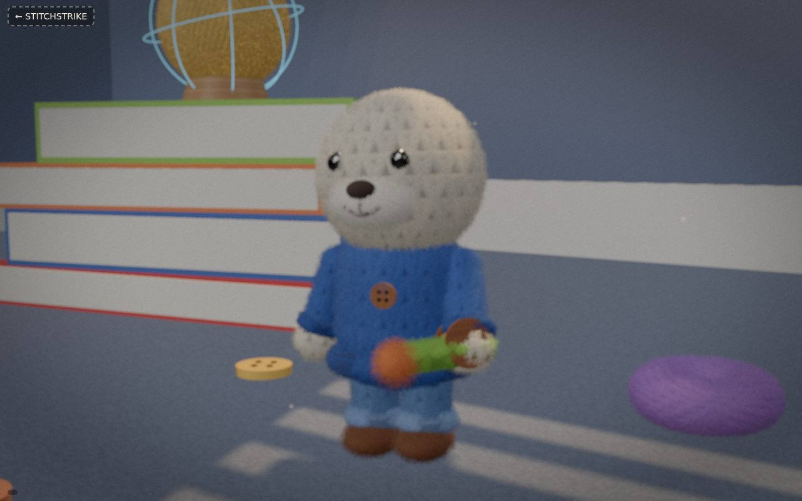
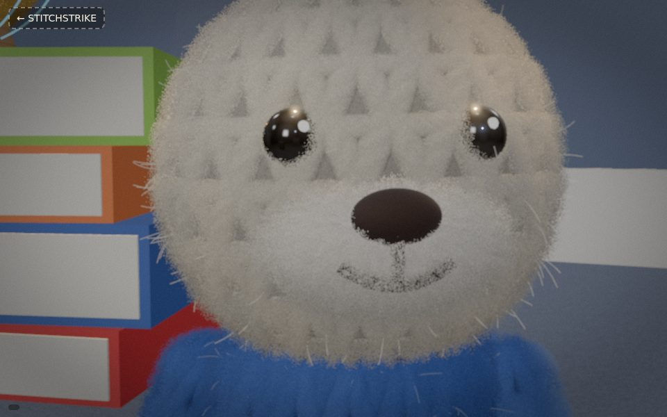
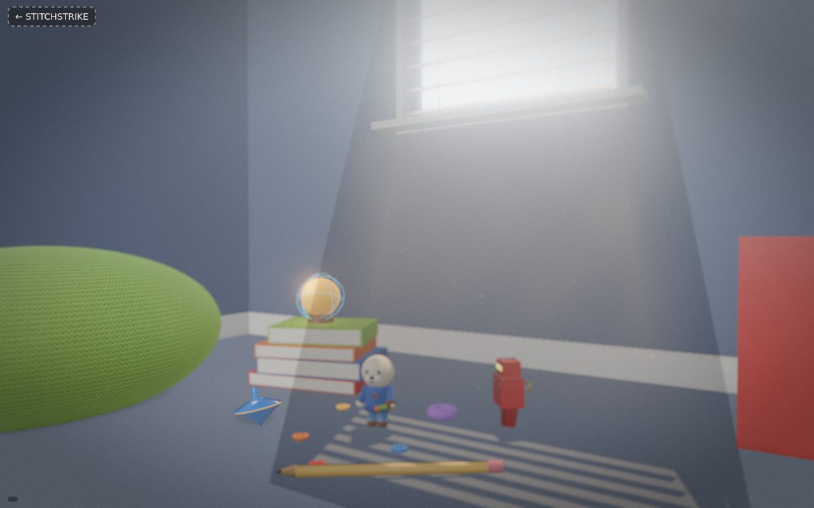
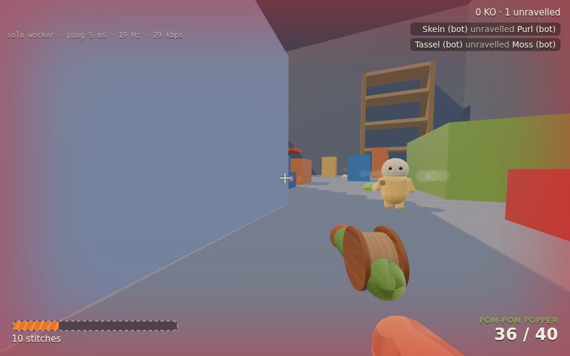

# STITCHSTRIKE

**Soft toys. Hard fights.** A browser multiplayer toy shooter where hand-knitted wool toys defend a child's room from mass-made plastic invaders. Built with Three.js and TypeScript.

The full design lives in [`docs/BUILD_PLAN.md`](docs/BUILD_PLAN.md). This repository currently contains **Phase 0** from that plan (§20): the two riskiest prototypes, built side by side so they can be merged in week 4.

| Prototype | Page | What it proves |
|---|---|---|
| **0(a) Wool lookdev** | `/wool.html` | Pip, a crocheted seal, in a grey-box bedroom corner under a sunbeam through blinds. Every layer of the §13.3 wool shader can be toggled and tuned live. |
| **0(b) Networked arena** | `/arena.html` | Grey-box Sunbeam Bedroom. Authoritative server, client prediction, reconciliation, interpolation and lag-compensated hitscan, with bots filling empty slots. |
| **Solo** | `/arena.html?solo=1` | The same server code running in a Web Worker, so no server is needed (§17.6). |



| Close-up (Ultra: shells + stray fibres) | Bedroom corner (wide) | Arena vs bots (solo worker) |
|---|---|---|
|  |  |  |

_Rendered headless with SwiftShader; stills from `?still=1`._

## Quick start

```bash
pnpm install
pnpm dev          # game server on :8787 + Vite on :5173 (the /ws path is proxied to the server)
```

Open http://localhost:5173. Other scripts:

```bash
pnpm test         # shared simulation tests (movement, protocol, lag compensation, prediction)
pnpm typecheck    # tsc -b across all packages
pnpm build        # production client build -> packages/client/dist
pnpm loadtest -- --clients 8 --seconds 10    # headless bot clients against a running server
```

### Arena URL options

| Param | Meaning |
|---|---|
| `?room=ABCD` | Private room code (share the link) |
| `?bots=0..7` | Bots fill the room up to this many players (server default 4) |
| `?lag=150` | Fake round-trip latency added client-side, for testing netcode feel |
| `?solo=1` | Run the server in a Web Worker instead of connecting |
| `?name=Pip` | Display name |
| `?server=ws://host:8787` | Connect to a server on another origin |

Server environment variables: `PORT` (8787), `FILL_BOTS` (4), `FAKE_LAG_MS` (one-way delay per direction).

Controls: WASD move · mouse look/fire · Space jump (double jump) · Shift sprint · C crouch · R reload · V first/third person · Tab scores · F3 net stats.

### Lookdev URL options

`?quality=low|medium|high|ultra` · `?cam=hero|backlit|closeup|wide` · `?gui=0` · `?dof=0` · `?still=1` (render a few frames and stop; used for screenshots).

## Layout

```
packages/
  shared/   simulation that must match on client and server (plan §18.2 "golden rule")
            constants, world (grey-box bedroom), movement + weapon step, raycasts,
            binary protocol, Room (authoritative sim + lag compensation), bots, RoomHost
  server/   Node WebSocket server: rooms by code, 30 Hz tick, 20 Hz snapshots
  client/   Vite + Three.js
            src/wool/    procedural stitch maps + layered wool material
            src/scene/   Pip, props, bedroom corner, post chain, arena world, avatars
            src/net/     transports (WebSocket / Worker / fake lag) and the predicting NetClient
  tools/    headless load tester
docs/BUILD_PLAN.md
```

## How the netcode works (plan §17)

- **Inputs** are fixed 1/60 s commands (buttons, float32 yaw and pitch, and render tick), sent in pairs (30 packets/s).
- **Server** (30 Hz) applies each player's queued commands with the shared `stepPlayer`, limited by a real-time budget so input flooding can't speed-hack. Snapshots go out at 20 Hz.
- **Snapshots** are binary: the recipient's own state at full precision (so replays are exact), other players quantised to 16 bits per axis, and this interval's shots at 9 bytes each. Rare events (KOs, roster) are JSON.
- **Prediction and reconciliation:** the client runs the same step function, and on each snapshot it rewinds to the server state and replays the unacknowledged inputs. Any error is eased out over ~100 ms.
- **Interpolation:** other players are drawn 100 ms in the past between the two snapshots around that time.
- **Lag compensation:** every input carries the tick the client was rendering. The server rewinds targets to that time (capped at 200 ms) before testing the ray.

Measured locally: 20 Hz snapshots; ~29 kbps per client with 4 players and ~44 kbps with 8 players all firing (budgets: 64 / 96 kbps). The test suite checks that a predicting client matches the server exactly. In a headless browser run at 150 ms RTT, every reconciliation sample was 0.

## The wool shader (plan §13.3)

`createWoolMaterial()` extends `MeshPhysicalMaterial`:

1. **Stitch normals and cavity AO** from procedural, tileable height fields: stocking, rib, garter, crochet, felt and wound yarn (`src/wool/stitches.ts`). No texture files are needed.
2. **Hand-dyed tint**: a per-stitch random value plus low-frequency world-space noise.
3. **Sheen** (`sheen = 1`, tunable roughness).
4. **Fuzz rim**: a fresnel term, strongest when backlit by the sun.
5. **Shell fuzz**: up to 16 alpha-tested shells in one instanced draw. Shells only render within a set distance of the camera.
6. **Stray fibres**: a few hundred curved line strands (Ultra only).
7. **Wrap lighting** on the diffuse term only. Wrapping the specular term too makes its visibility term blow up at silhouettes.

Quality presets toggle layers as the plan describes. Every material shares one set of uniforms, so the debug panel tunes all of them live.

## What's next (Phase 1)

A grey-box co-op loop: Heartspools and Spools, 3 weapons with their physical effects, 4 buildables on build pads, 3 enemy types with navmesh AI on the server, and 5 waves. Merge the wool figure into the arena as the player avatar and view model, and add path-event enemy sync (§17.3 item 8) before the enemy count grows.
