# STITCHSTRIKE

**Soft toys. Hard fights.** An indie first- and third-person shooter that blends wave-based tower defence with intense action, and a love letter to 90s childhoods. You are a little amigurumi toy in a giant, cosy, hand-knitted world. Everything is wool: the toys, Baron von Ravel's Mass-Knit Army, every room, the trees, the water and the city outside the window, all in the warm look of a stop-motion knit film. Defend the glowing **Heartspools** in a messy **bedroom**, the **back garden**, the **garage**, the **bathroom**, a **toy store aisle** or an autumn **city park**: alone with bots, online with up to 4 friends, or up to four to a couch in split-screen. PvP Free-for-All, Team Deathmatch and King of the Spool are in too. It's built with Three.js and TypeScript, with server-authoritative netcode, and ships as a desktop app ready for Steam.

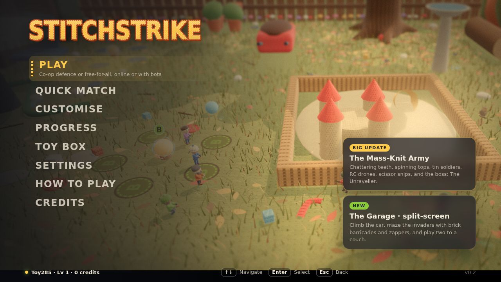

| The City Park | Wave 5 at the bandstand | The parade balloon |
|---|---|---|
| 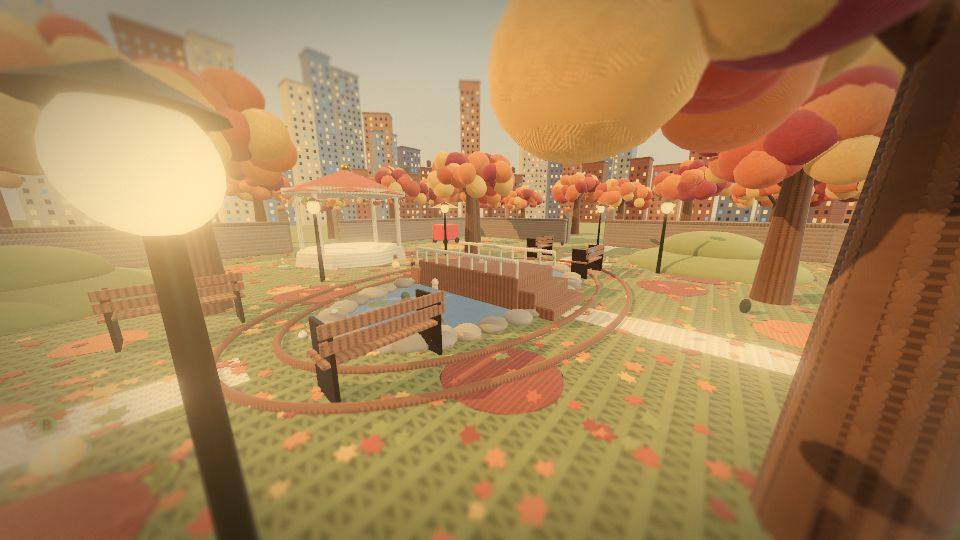 | 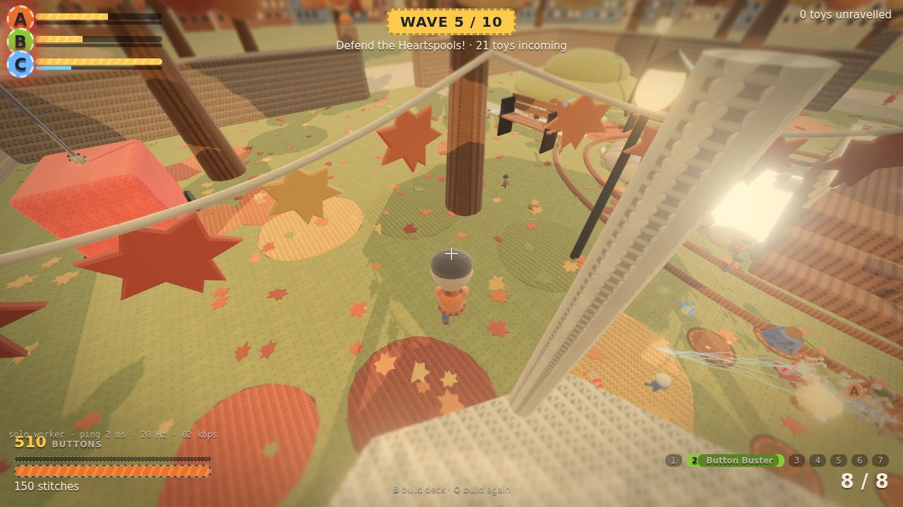 | 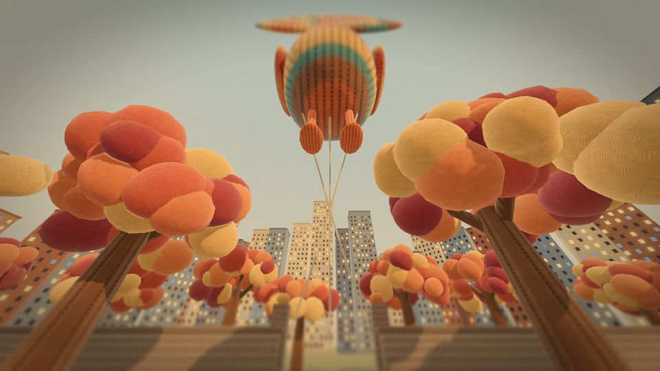 |
| **The cosy bedroom** | **The autumn Back Garden** | **The Bathroom** |
| 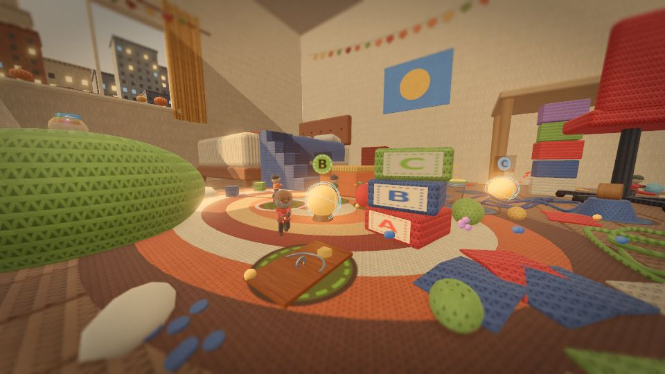 | 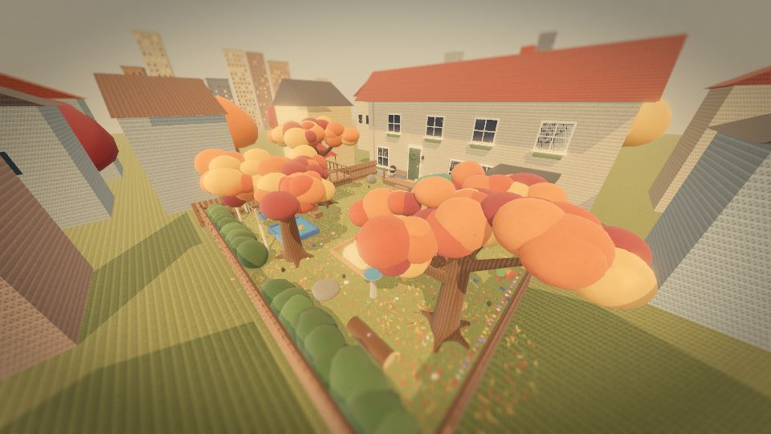 | 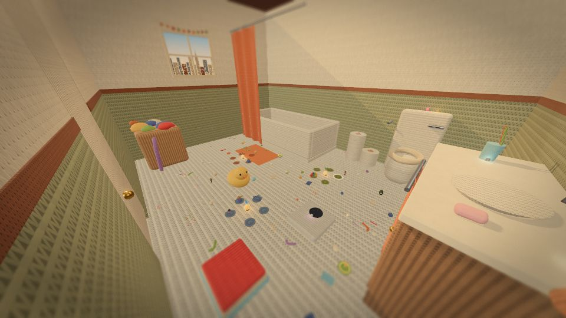 |
| **The amigurumi cast** | **Grumble, up close** | **The Unraveller and his army** |
| 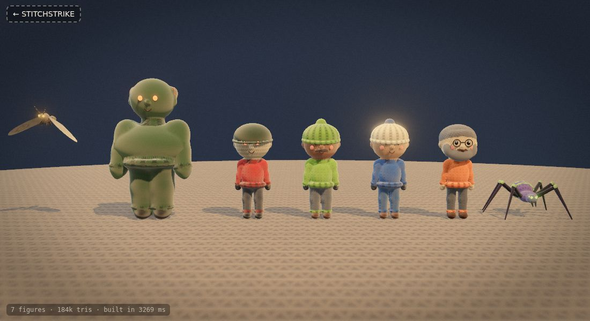 | 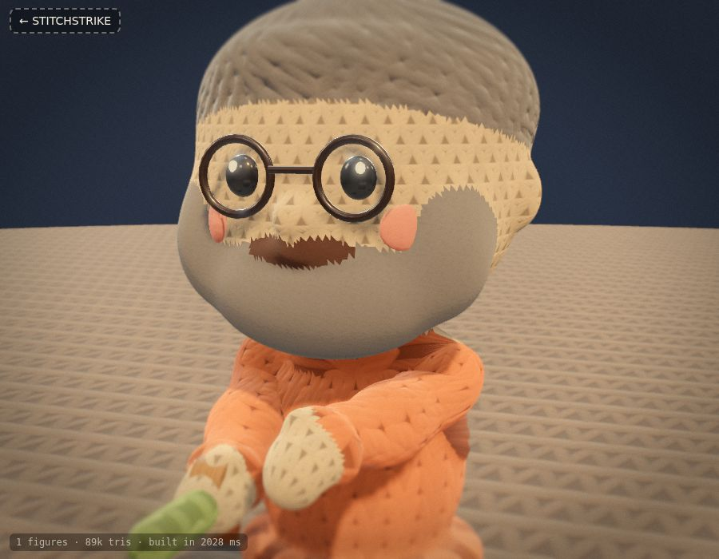 | 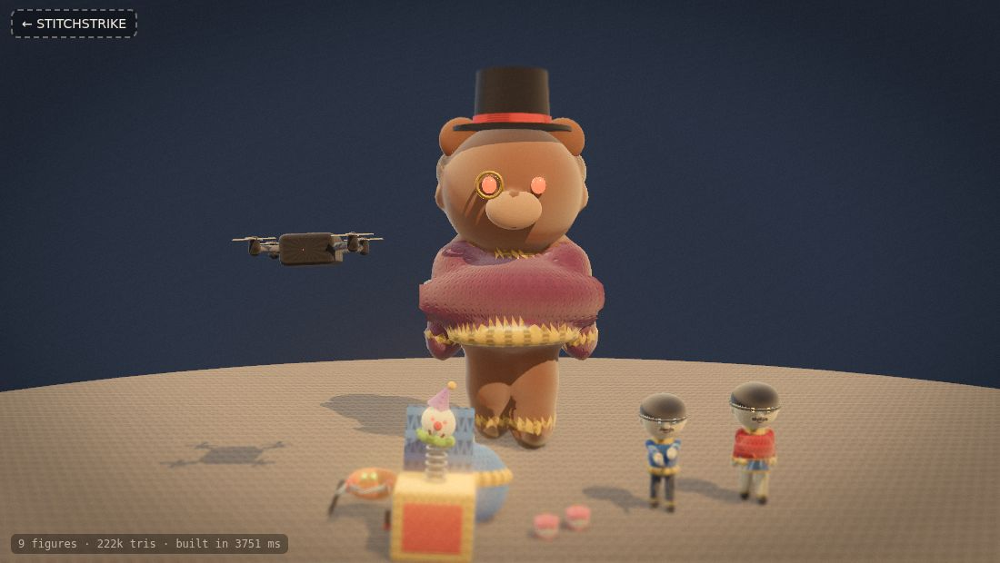 |
| **Tin Drummer and Jack-in-the-Box** | **Play: mode, mission, difficulty, map** | **Customise your toy (earned, never bought)** |
| 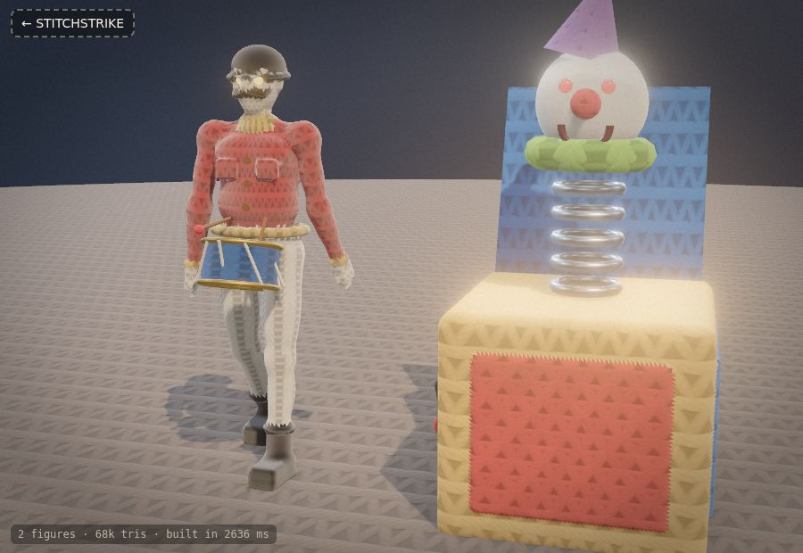 | 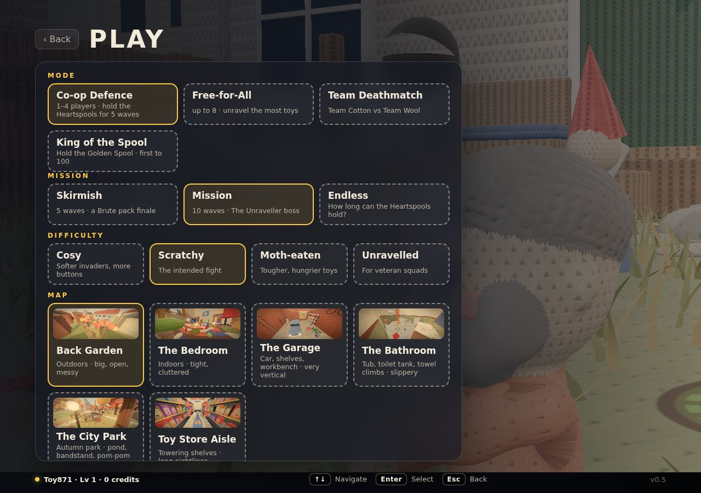 | 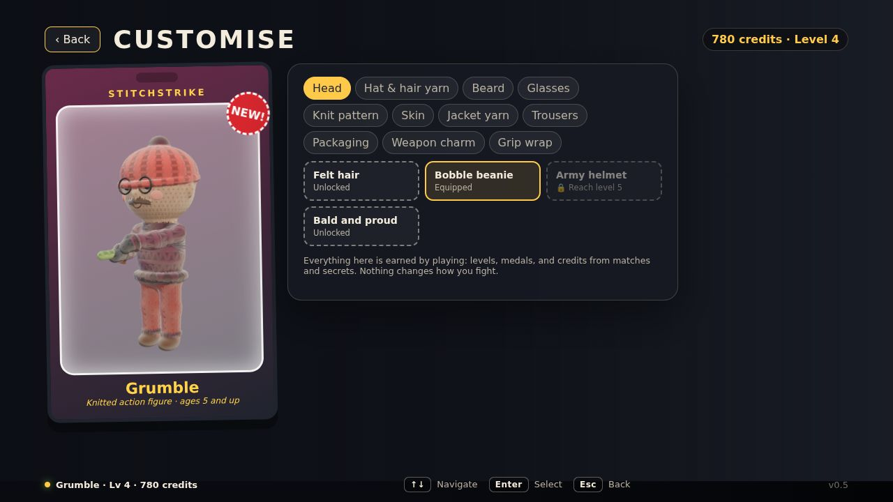 |

_Screenshots are headless renders with SwiftShader, so real GPUs look sharper._

## Play

```bash
pnpm install
pnpm dev          # game server on :8787 + Vite on :5173 (/ws and /health are proxied to the server)
pnpm desktop      # or: the Electron desktop app (fullscreen; F11 toggles)
```

Open http://localhost:5173. Press any key over the live cinematic to reach the main menu:
- **Play:** choose a mode, a mission (Skirmish 5 waves, Mission 10 waves with the boss, or Endless), a difficulty (Cosy, Scratchy, Moth-eaten, Unravelled) and a map. Then play offline with bots, in an online room, or split-screen.
- **Quick match**
- **Customise**
- **Progress**
- **Toy Box**
- **Settings**
- **How to play**
- **Credits**
- **Quit** (desktop only)

The menu works with mouse, keyboard and gamepad.

| Mode | Direct link |
|---|---|
| Co-op defence, 1–4 players; bots fill empty slots and fight, build and re-stitch | `/arena.html?mode=coop&map=garage&waves=10&difficulty=1` |
| Co-op solo; the real server runs in a Web Worker, no network needed | `/arena.html?mode=coop&solo=1` |
| PvP Free-for-All (up to 8) / Team Deathmatch (Team Cotton vs Team Wool) | `/arena.html?mode=pvp` / `?mode=tdm` |
| Local split-screen for two players on one PC | `/split.html?mode=coop&map=garden` |
| Toy Box: every sculpted character; `?focus=army` for the Mass-Knit Army | `/figures.html` |
| Wool shader lookdev | `/wool.html` |

Friends join with the same room code, mode, map and mission settings. The desktop app hosts rooms itself, and `--lan` opens them to your network. See [docs/DESKTOP_AND_STEAM.md](docs/DESKTOP_AND_STEAM.md) for building the Windows `.exe` and releasing on Steam.

### Controls

| Keyboard and mouse | Gamepad | Action |
|---|---|---|
| WASD · mouse | left stick · right stick | move · look |
| hold mouse button | RT | fire |
| Space (twice) · Shift · C | A · L3 · B | jump (double) · sprint · crouch |
| 1–7 · mouse wheel | RB | weapons |
| hold right mouse · X | hold LB | yarn-swing: hook anything above you, jump to let go |
| jump at a ledge, hold W | jump, push the stick | mantle up onto it |
| R | X | reload |
| B, then 1–7 · Q | D-pad up, left/right, then LT | build deck: build or upgrade on your pad · build again |
| G · Enter / F | D-pad down · Start | recycle (50%) · ready up |
| hold E | hold Y | re-stitch a downed teammate |
| walk into fabric or bark | push the stick into it | climb |
| V · Tab · Esc | R3 · View | camera · scores · pause |

Every keyboard action can be rebound in Settings → Key bindings.

### The game

- **Weapons:**
  - **Pom-Pom Popper:** assault
  - **Button Buster:** shotgun
  - **Needle Lance:** sniper that pierces 3 toys
  - **Crochet Hook:** SMG
  - **Yarn-Ball Launcher:** a lobbed yarn ball that bursts, knocks back and tangles crowds
  - **Glue Gun:** fast hot-glue globs that glue invaders in place
  - **Static Sock:** a chain zap that arcs to up to three more targets

  Every weapon is available from the start.
- **Toys** have 150 stitches, plus up to 100 thimble armour.
  - **Stitch-up:** after 4 s out of combat you knit yourself back together.
  - **Down and re-stitch (co-op):** you go down instead of out, and a teammate holds E to re-stitch you. Clearing a wave re-stitches everyone.
  - **Pickups:** stuffing heals, thimbles armour you, and Power Poms give ×1.5 damage. Invaders sometimes drop stuffing.
- **Heartspools** (A, B, C): a thread shield absorbs damage first and regrows between waves. Lose all three and the memories are gone.
- **Build phase:** spend the team's **buttons** on the embroidered pads. Building the same trap again upgrades it to tier 2 and then tier 3.
  - **Pom-Pom Turret:** auto-fires at the nearest invader.
  - **Pin Wall:** a tough blockade.
  - **Brick Barricade:** a cheap blockade for mazing.
  - **Tangle Mat:** slows walkers by 60%.
  - **Battery Zapper:** chains a shock through up to 4 invaders.
  - **Mousetrap:** one huge snap, then it re-arms.
  - **Spring Pad:** launches toys up to high ground.
- **Mazing:** blockades re-bake the invaders' flow fields, so they walk the long way round. They only chew through when there is no way round.
- **The Mass-Knit Army:**
  - **Knit Grunts**
  - **Scuttler** spider-crabs
  - felt **Moths**
  - **Felted Brutes**, which flatten traps
  - **Chatter Teeth** swarms
  - **Spinning Tops**, which bowl toys over
  - **Tin Soldiers**, which shoot from range
  - **RC Drones**, which drop teeth
  - **Scissor Snips**, which cut traps apart
  - **Tin Drummers**, whose drumming speeds up every invader nearby
  - **Jack-in-the-Boxes**, which spring their clowns at toys who get close
  - **The Unraveller**, the boss: a giant felted bear in a top hat that stomps
- **Missions:** 10 waves with the boss, a 5-wave skirmish, or endless (every loop tougher, a boss every 10th wave).
  - Four difficulties scale invader health, numbers, damage and starting buttons.
  - Sgt. Tuft Buttonsworth briefs you and Baron von Ravel taunts you, Saturday-morning-cartoon style.
  - Solo practice can start at any wave: `&wave=8`.
- **Traversal and secrets:** climb bedsheets, curtains, tree bark, hedges, towels, SALE banners, the pegboard and the ladder. Mantle up ledges, swing on a strand of yarn from anything overhead, and let spring toys launch you onto shelves, desks and roofs. Every map hides 8 golden thimbles, weapon parts and credit stashes.
- **Progression, with zero pay-to-win:** XP, levels, credits and ten medals unlock heads, hat and hair yarns, beards, glasses, knit patterns, jacket and trouser yarns, six 90s packaging styles, and weapon charms and grip wraps that you unlock by finding weapon parts. Your figure appears on the end-of-match results card in its blister-pack packaging. Nothing affects combat, and nothing is for sale.
- **Maps:**
  - **The Bedroom:** bed, desk, bookshelf, climbable curtain.
  - **The Back Garden:** house, shed, treehouse, pond, yarn grass.
  - **The Garage:** a car you crawl under and climb onto, steel shelving, a workbench and pegboard, and a roll-up door stuck half open.
  - **The Bathroom:** a bubble-bath tub, a climbable shower curtain, the toilet tank as a sniper perch, a toilet-roll staircase.
  - **The Toy Store Aisle:** towering shelves of boxed 90s toys, SALE banners to climb, a ball pit, a trolley and the checkout.
  - **The City Park:** an autumn park of pom-pom trees, a knitted pond under a humped footbridge, a bandstand perch, hills, benches and lamp posts, ringed by a knitted city, with a giant turkey parade balloon overhead.
- **Modes:** co-op defence (solo with bots, online up to 4, split-screen for 2–4), Free-for-All, Team Deathmatch and **King of the Spool** (two teams fight to stand on a Golden Spool that hops around the map; first to 100).
- **Accessibility:** colour-blind palettes, subtitles and sound captions, reduced camera shake, full key rebinding.
- **Steam:** medals unlock Steam achievements and rich presence shows what you're playing (desktop build with steamworks.js; see [docs/DESKTOP_AND_STEAM.md](docs/DESKTOP_AND_STEAM.md)).
- **Sound:** every sound is synthesized, with no audio files. There's a music-box menu theme, a garage-rock combat score that follows the match, and weapon and invader effects.

Balance check (full simulated matches, bots only, 2-second build phases): 4 bots hold out to around wave 5 of 10 on Scratchy on every map. A human team has to build and maze well to reach the boss.

### URL options

`?mode=coop|pvp|tdm|koth` · `?map=bedroom|garden|garage|bathroom|toystore|park` · `?waves=5|10|0` · `?difficulty=0..3` · `?wave=N` (solo practice start) · `?room=ABCD` · `?solo=1` · `?bots=0..7` · `?lag=150` · `?name=Pip` · `?quality=low|medium|high` · `?server=ws://host:8787` · `?cam=overview|core|…` (fixed spectator camera) · `?autopilot=1` (headless smoke tests) · `?lod=0` (full-detail invaders at any distance). Split-screen: `split.html?players=2|3|4`.

Server env: `PORT` (8787), `FILL_BOTS` (4), `FAKE_LAG_MS` (one-way per direction), `STATIC_DIR` (also serve the built client).

```bash
pnpm test         # 110 tests: movement, mantle and yarn-swing, weapons, pickups, down/re-stitch, invaders, traps,
                  # mazing, missions, King of the Spool, protocol, lag comp, prediction, co-op on every map,
                  # progression and weapon parts, settings, SDF mesher, rig
pnpm typecheck    # tsc -b across all packages
pnpm build        # production client -> packages/client/dist
pnpm loadtest -- --url ws://localhost:8787 --clients 4 --seconds 30 --mode coop
```

## How it's built

```
packages/
  shared/   everything that must agree on client and server
            movement + weapons (deterministic step), world + co-op layout, enemies + nav flow fields,
            CoopDirector (waves, Heartspools, pads, buttons), Room (authoritative sim, lag compensation),
            bots, binary protocol, RoomHost (transport-agnostic loop)
  server/   Node WebSocket server (startGameServer): rooms by mode + map + code, 30 Hz tick, 20 Hz snapshots, optional static client
  desktop/  Electron app: embeds the server, serves the client, Steam/Windows packaging (electron-builder)
  client/   Vite + Three.js
            src/wool/    procedural stitch maps + the layered wool material (UV or world-space/triplanar)
            src/scene/   woolGarden (the outdoor map), woolRoom (the bedroom), woolKit + mess (shared knitted
                         building blocks and clutter), enemyRenderer (knitted enemies),
                         coopProps (Heartspools, pads, buildables), fx, viewModel, avatars, Pip, post chain
            src/menu-main.ts + scene/cinematic.ts   main menu over a live six-shot in-engine cinematic; audio/music.ts
            src/menu-customise.ts, progression.ts, profile.ts   customise, progress, XP/medals/unlocks (local profile)
            src/split-main.ts   local split-screen · src/input/gamepad.ts · src/briefing.ts (cartoon briefings)
            src/scene/   woolGarage, traversalView (jump pads, secrets), pickupsView, weaponModels
            src/figures/invaders.ts   teeth, top, drone, snip, tin soldier, The Unraveller
            src/net/     transports (WebSocket / Worker / fake lag) and the predicting NetClient
            src/audio/   synthesized sound effects (Web Audio, no files)
  tools/    headless load tester
docs/BUILD_PLAN.md       the full design
```

### The cosy stop-motion look

The game aims for the feel of a hand-made stop-motion knit film:
- **Amigurumi toys** (`src/figures/amigurumi.ts`): big round crochet heads with bead eyes, felt blush and a stitched smile, chubby sweaters with ribbed turtlenecks, mitten hands and round felt shoes, knitted hair caps, bobble beanies and fuzzy beards. The boss is a felted teddy bear in a top hat.
- **Chunky knit everywhere:** environment stitches are big and deep, and every yarn colour is softened and warmed by a hand-dyed tone (`yarnDye`).
- **Golden light and a film grade** (`src/scene/post.ts`): warm split-toning, soft bloom and an optional tilt-shift "miniature focus" that keeps the aiming area sharp.
- **Set dressing** (`src/scene/cozyDressing.ts`): a knitted city skyline with lit windows outside every window and on every horizon, autumn leaf bunting, knitted pumpkins, shaggy pom-pom trees and glossy knitted water.

### 3D figures, sculpted in code

The characters are real 3D sculpts rather than capsules, and there are no model files: each one is sculpted in code (`src/figures/`). The amigurumi style is the default; the original realistic action-figure sculpt below is still available as `style: 'realistic'`.

1. **Sculpt:** the figure is a signed-distance description of its anatomy.
   - Head: skull, jaw, cheekbones, brow ridge, nose, lips, ears and carved eye sockets.
   - Body: neck, trapezius, pecs, deltoids, biceps and forearms, gloved hands with curled fingers and a thumb, glutes, quads, knees and calves.
   - Clothing on top: a knitted jacket with ribbed collar, cuffs and hem, pocket flaps, a belt, trousers, felt boots with soles, a beanie with pompom or a helmet, felted hair, beard and mustache.
2. **Mesh:** a sparse Surface Nets pass meshes the SDF (`sdf.ts`). Vertices are projected onto the true surface and given analytic normals.
3. **Rig** (`rig.ts`):
   - skin weights blended across joints
   - **knit-flow UVs**: stitch rows wrap around each bone like a real knitted toy, with seams at the joints and a crochet spiral at the crown
   - each clothing region becomes its own knitted material
   - in-game crowds merge regions into one draw per stitch pattern, with vertex colours
4. **Animate:** procedural animation (`humanoid.ts`, `creatures.ts`).
   - walk and run cycles driven by distance travelled
   - two-handed blaster holds with analytic **two-bone IK** that follow aim pitch
   - crouch, jump tuck and toppling when unravelled
   - a tripod gait for the six-legged Scuttler
   - wing flaps for the felt Moth
5. **Hard accessories:** bead eyes (glowing on enemies), black plastic glasses, wooden buttons and a brass buckle.

The cast:
- **Heroes:** four looks, with the jacket in each player's yarn colour. "Grumble" recreates the bearded, spectacled knitted figure from the reference photo.
- **Enemies:** the acrylic-knit Grunt soldier with a knitted rifle, the hulking felted Brute, the jointed crochet Scuttler, and the felt Moth with painted eye-spot wings.
- **First person:** sculpted knitted sleeves and gloved hands gripping the blaster.

Meshing takes about 0.4–0.7 s per character and is cached, so instances are cheap clones. A hero is about 37k triangles, an in-game Grunt about 17k.

### Everything is wool

`createWoolMaterial()` extends `MeshPhysicalMaterial` with the layers from plan §13.3:

1. procedural stitch normals and cavity AO: stocking, rib, garter, crochet, felt, wound yarn
2. per-stitch hand-dyed tint
3. sheen
4. a backlit fuzz rim
5. instanced shell fuzz
6. stray fibres
7. diffuse-only wrap lighting

The room uses a **triplanar** variant: stitches are mapped in world space by the dominant normal axis, so every wall, bed, desk and toy block is knitted at the same gauge without UV work. Every collision box is dressed as the real object it stands for (`woolFurniture.ts`), all in wool:
- a bed with frame, buttoned headboard, quilted mattress, a draped duvet with folds, pillows and a crochet throw
- a desk with turned legs, a knitted desk lamp and crocheted notebooks
- a red swivel chair with backrest and five-star base
- knitted floorboards and an open doorway where the enemies crawl in
- mess: socks, crayons, open books, buttons, crumpled paper and tangles of loose yarn all over the floor
- toys: alphabet blocks with embroidered letters, a laced toy drum, a toy chest, a toy car, standing books and a ruler
- decoration: a crochet rag rug, knitted curtains, a shelf of knitted books, a felt poster with a crocheted sun, a knitted pendant lamp, and a yarn-ball mobile The only direct light is the sun through the window, with a light shaft and dust motes. The post chain adds GTAO, bloom, AgX tonemapping, vignette and grain.

### The Back Garden

The second map (`shared/src/garden.ts` for collision and co-op layout, `client/src/scene/woolGarden.ts` for the look) takes the fight outdoors at toy scale:
- **Nature:** a sky dome with a sun and felted clouds; a knitted lawn with up to 42,000 instanced yarn grass blades swaying in gusts of wind (a vertex shader); three trees sculpted with the same SDF mesher as the characters (root flares, a leaning trunk, branches) under fuzzy felted canopies; hedges, flower beds, window boxes, fallen autumn leaves, a lily pond with stepping stones, and rocks and logs.
- **Buildings:** the family house with a garter-knit facade, gable roof, chimney, gutter, windows with curtains, a back door with a wreath and a wall lamp; a deck with a barbecue, bench and potted plants; a shed you can walk into (workbench, paint tins, rope and saw); and a treehouse with railings and a red tent roof, climbed via stacked crates. The neighbours' knitted houses and distant felt trees fill the horizon beyond the picket fence.
- **Mess:** a wheelbarrow of soil, a gnome, a birdbath, buckets, a garden hose snaking across the lawn, a washing line of knitted laundry, flamingos, a sandbox with a crocheted sandcastle, a paddling pool with a rubber duck, a table with a parasol and chairs, and scattered socks, balls, blocks, buttons, paper, sticks, frisbees and tangles of loose yarn (`mess.ts`, also used indoors).

Everything is walkable and fightable. Enemies path around the shed, pool and sandbox. The treehouse is a sniper nest, and the three Heartspools sit by the deck, the lawn and the shed. Grass density and shadow resolution follow `?quality=`.

Enemies are sculpted, rigged figures pooled per type, each animated from its own movement: walk cycles, snapping jaws, spinning tops, whirring rotors and snipping blades. When one unravels, it pops apart into knitted pieces that bounce like soft toys, plus curls of yarn fluff and a puff of stuffing.

### Netcode (plan §17)

- **Inputs:** fixed 1/60 s commands sent in pairs. The server runs the shared step under a real-time budget, which stops speed hacks.
- **Snapshots** at 20 Hz:
  - your own state at full precision, for exact replays
  - quantised players (with armour, downed and re-stitch state)
  - 9-byte shots (15 with a start point for zaps and invader fire)
  - yarn balls in flight, a pickup availability mask and stuffing drops
  - a co-op block: phase, wave, timer, buttons, cores, pads (kind, tier, health), difficulty and boss health
  - enemies at 8 bytes each, sent at **10 Hz** (every other snapshot) to fit the budget
- **Inputs** carry a weapon byte and a one-shot action byte (build kind, recycle, ready).
- **Client:** prediction and reconciliation for your own toy. Other players are interpolated 100 ms in the past, enemies 160 ms.
- **Lag compensation** rewinds players (PvP) or enemies (co-op) to the time stamped on your input, capped at 200 ms.
- **Measured:**
  - 4-player co-op through waves: ~47 kbps per client (budget 64)
  - 8-player PvP: ~47 kbps (budget 96)
  - two real browser clients at 120 ms RTT: 0.000 u reconciliation error over 40 s

## Roadmap from here

See **[docs/ROADMAP.md](docs/ROADMAP.md)** for the design brief, the development pillars, and a build-status checklist of what is done and what comes next (Steam lobbies and achievements, more maps, bosses per map, and more).
