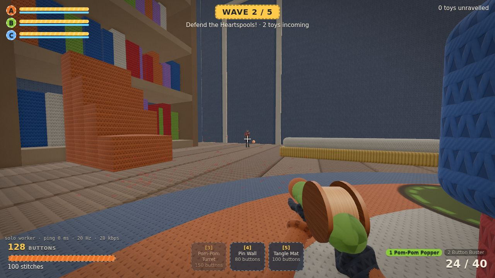
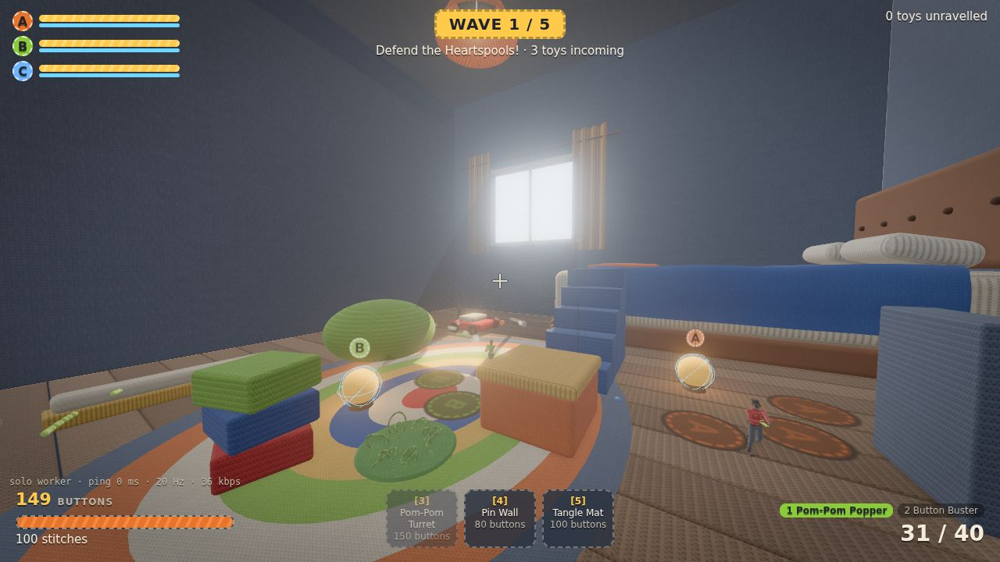
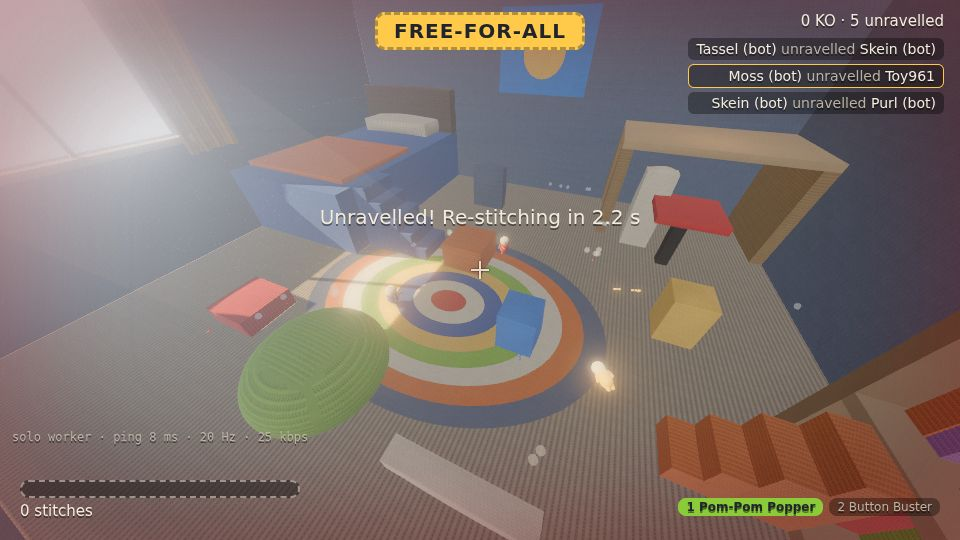

# STITCHSTRIKE

**Soft toys. Hard fights.** A browser multiplayer toy shooter where everything is wool: the heroes, the enemies and the whole room. Knitted toys defend glowing **Heartspools** from waves of mass-knit invaders in a giant crocheted bedroom. Built with Three.js and TypeScript, with a server-authoritative netcode.


| Grumble: a realistic knitted action figure | The all-wool bedroom | First person: knitted gloves on the Popper |
|---|---|---|
|  |  |  |
| **Heartspools A and B, pads, alphabet blocks** | **PvP free-for-all** | **Pip (wool shader lookdev)** |
|  |  |  |

_Screenshots are headless renders with SwiftShader, so real GPUs look sharper._

## Play

```bash
pnpm install
pnpm dev          # game server on :8787 + Vite on :5173 (the /ws path is proxied to the server)
```

Open http://localhost:5173 and pick a mode:

| Mode | Link | What happens |
|---|---|---|
| **Co-op defence** (1–4 players) | `/arena.html?mode=coop` | Build phase, then waves. Protect Heartspools A, B and C through 5 waves. Bots fill empty slots; they fight and build too. |
| **Co-op solo** | `/arena.html?mode=coop&solo=1` | The same server code runs in a Web Worker in your browser, so no server is needed. |
| **PvP free-for-all** (up to 8) | `/arena.html?mode=pvp` | Lag-compensated shooting in the same knitted bedroom. |
| **Toy Box** | `/figures.html` | Every sculpted, rigged character on a turntable (`?focus=grumble\|grunt\|brute\|creatures`, `?pose=idle\|walk\|run\|aim\|crouch\|jump\|downed`). |
| **Wool lookdev** | `/wool.html` | Pip the crocheted seal under a sunbeam, with every wool-shader layer adjustable live. |

Friends join the same match with the same room code: `/arena.html?mode=coop&room=ABCD` (the landing page has a join form).

### Controls

WASD move · mouse look/fire · Space jump (double jump) · Shift sprint · C crouch · R reload · **1/2** Pom-Pom Popper / Button Buster · **3/4/5** build Turret / Pin Wall / Tangle Mat on the pad you stand on · **G** recycle (50% refund) · **Enter** ready up (skip build time) · V first/third person · Tab scores · F3 net stats.

### Co-op rules

- **Heartspools** (A, B, C) have a blue thread shield that absorbs damage first and regrows during build phases. Lose all three and the match is lost.
- **Build pads** are the embroidered patches around each Heartspool. Costs are paid in **buttons**, a team pool you earn by unravelling enemies and clearing waves:
  - **Pom-Pom Turret** (150): auto-fires at the nearest enemy in sight.
  - **Pin Wall** (80): a felt pin-cushion that blocks the lane until chewed through.
  - **Tangle Mat** (100): slows walking enemies by 60%.
- **Enemies**, all knitted:
  - **Knit Grunt**: acrylic soldier.
  - **Scuttler**: fast crocheted spider-crab.
  - **Moth**: felted flyer that goes straight for the wool.
  - **Felted Brute**: a tank that flattens buildables.
- **Pathing:** ground enemies follow flow fields over a nav grid to their target Heartspool. They turn on nearby toys and push through walls.
- **Scaling:** 5 waves, with enemy count and HP growing with the number of players. Victory or defeat restarts the match after 12 s.

Balance check (full simulated matches, bots only): 1–4 bots lose around waves 4–5, so a human team has to build well to win. Server cost is about 60–80 µs per tick for a full wave.

### URL options

`?mode=coop|pvp` · `?room=ABCD` · `?solo=1` · `?bots=0..7` (fill-to count) · `?lag=150` (fake round-trip ms) · `?name=Pip` · `?quality=low|medium|high` · `?server=ws://host:8787` · `?cam=overview|window|core` (fixed spectator camera) · `?autopilot=1` (headless smoke tests).

Server env: `PORT` (8787), `FILL_BOTS` (4), `FAKE_LAG_MS` (one-way per direction).

```bash
pnpm test         # 38 tests: simulation (movement, protocol, lag comp, prediction, co-op) + SDF mesher and figure rig
pnpm typecheck    # tsc -b across all packages
pnpm build        # production client -> packages/client/dist
pnpm loadtest -- --clients 4 --seconds 30 --mode coop   # headless clients against a running server
```

## How it's built

```
packages/
  shared/   everything that must agree on client and server
            movement + weapons (deterministic step), world + co-op layout, enemies + nav flow fields,
            CoopDirector (waves, Heartspools, pads, buttons), Room (authoritative sim, lag compensation),
            bots, binary protocol, RoomHost (transport-agnostic loop)
  server/   Node WebSocket server: rooms by mode + code, 30 Hz tick, 20 Hz snapshots
  client/   Vite + Three.js
            src/wool/    procedural stitch maps + the layered wool material (UV or world-space/triplanar)
            src/scene/   woolRoom (the all-wool bedroom), enemyRenderer (instanced knitted enemies),
                         coopProps (Heartspools, pads, buildables), fx, viewModel, avatars, Pip, post chain
            src/net/     transports (WebSocket / Worker / fake lag) and the predicting NetClient
            src/audio/   synthesized sound effects (Web Audio, no files)
  tools/    headless load tester
docs/BUILD_PLAN.md       the full design
```

### Realistic 3D figures, then wool

The characters are real 3D sculpts rather than capsules, and there are no model files: each one is sculpted in code (`src/figures/`).

1. **Sculpt:** the figure is a signed-distance description of its anatomy.
   - Head: skull, jaw, cheekbones, brow ridge, nose, lips, ears and carved eye sockets.
   - Body: neck, trapezius, pecs, deltoids, biceps and forearms, gloved hands with curled fingers and a thumb, glutes, quads, knees and calves.
   - Clothing on top: a knitted jacket with ribbed collar, cuffs and hem, pocket flaps, a belt, trousers, felt boots with soles, a beanie with pompom or a helmet, felted hair, beard and mustache.
2. **Mesh:** a sparse Surface Nets pass meshes the SDF (`sdf.ts`). Vertices are projected onto the true surface and given analytic normals.
3. **Rig** (`rig.ts`):
   - skin weights blended across joints
   - **knit-flow UVs**: stitch rows wrap around each bone like a real knitted toy, with seams at the joints and a crochet spiral at the crown
   - each clothing region becomes its own knitted material
   - in-game crowds merge regions into one draw per stitch pattern, with vertex colours
4. **Animate:** procedural animation (`humanoid.ts`, `creatures.ts`).
   - walk and run cycles driven by distance travelled
   - two-handed blaster holds with analytic **two-bone IK** that follow aim pitch
   - crouch, jump tuck and toppling when unravelled
   - a tripod gait for the six-legged Scuttler
   - wing flaps for the felt Moth
5. **Hard accessories:** bead eyes (glowing on enemies), black plastic glasses, wooden buttons and a brass buckle.

The cast:
- **Heroes:** four looks, with the jacket in each player's yarn colour. "Grumble" recreates the bearded, spectacled knitted figure from the reference photo.
- **Enemies:** the acrylic-knit Grunt soldier with a knitted rifle, the hulking felted Brute, the jointed crochet Scuttler, and the felt Moth with painted eye-spot wings.
- **First person:** sculpted knitted sleeves and gloved hands gripping the blaster.

Meshing takes about 0.4–0.7 s per character and is cached, so instances are cheap clones. A hero is about 37k triangles, an in-game Grunt about 17k.

### Everything is wool

`createWoolMaterial()` extends `MeshPhysicalMaterial` with the layers from plan §13.3:

1. procedural stitch normals and cavity AO: stocking, rib, garter, crochet, felt, wound yarn
2. per-stitch hand-dyed tint
3. sheen
4. a backlit fuzz rim
5. instanced shell fuzz
6. stray fibres
7. diffuse-only wrap lighting

The room uses a **triplanar** variant: stitches are mapped in world space by the dominant normal axis, so every wall, bed, desk and toy block is knitted at the same gauge without UV work. Every collision box is dressed as the real object it stands for (`woolFurniture.ts`), all in wool:
- a bed with frame, buttoned headboard, quilted mattress, a draped duvet with folds, pillows and a crochet throw
- a desk with turned legs, a knitted desk lamp and crocheted notebooks
- a red swivel chair with backrest and five-star base
- knitted floorboards and an open doorway where the enemies crawl in
- toys: alphabet blocks with embroidered letters, a laced toy drum, a toy chest, a toy car, standing books and a ruler
- decoration: a crochet rag rug, knitted curtains, a shelf of knitted books, a felt poster with a crocheted sun, a knitted pendant lamp, and a yarn-ball mobile The only direct light is the sun through the window, with a light shaft and dust motes. The post chain adds GTAO, bloom, AgX tonemapping, vignette and grain.

Enemies are drawn with one `InstancedMesh` per body part per type, animated per instance (walk swing, wing flaps, hit squash). A full wave costs a few dozen draw calls. When an enemy unravels, it bursts into curls of yarn fluff in its own colour.

### Netcode (plan §17)

- **Inputs:** fixed 1/60 s commands sent in pairs. The server runs the shared step under a real-time budget, which stops speed hacks.
- **Snapshots** at 20 Hz:
  - your own state at full precision, for exact replays
  - quantised players
  - 9-byte shots
  - a co-op block: phase, wave, timer, buttons, cores and pads
  - enemies at 9 bytes each, sent at **10 Hz** (every other snapshot) to fit the budget
- **Client:** prediction and reconciliation for your own toy. Other players are interpolated 100 ms in the past, enemies 160 ms.
- **Lag compensation** rewinds players (PvP) or enemies (co-op) to the time stamped on your input, capped at 200 ms.
- **Measured:**
  - 4-player co-op through waves: ~44 kbps per client (budget 64)
  - 8-player PvP: ~46 kbps (budget 96)
  - two real browser clients at 120 ms RTT: 0.000 u reconciliation error over 40 s

## Roadmap from here

- **More maps:** kitchen counter, sewing room and attic from the plan, built with the same triplanar wool kit.
- **Plan features still missing:** Spools (carry-able shield batteries), the yarn-swing move, more weapons with physical effects, the full buildable deck, medals and unlocks, customisation.
- **Art and netcode:** hand-authored animation clips and facial expressions; moving figure meshing into a Web Worker; WebRTC/WebTransport datagrams for PvP.
