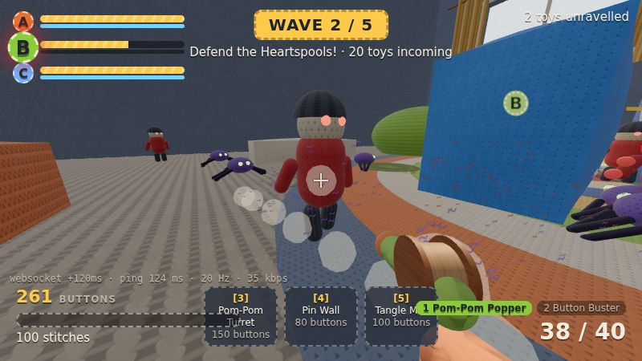

# STITCHSTRIKE

**Soft toys. Hard fights.** A browser multiplayer toy shooter where everything is wool: the heroes, the enemies and the whole room. Knitted toys defend glowing **Heartspools** from waves of mass-knit invaders in a giant crocheted bedroom. Built with Three.js and TypeScript, with a server-authoritative netcode.



| The knitted bedroom | Sunlight through the knitted curtains | Pip, the crocheted hero (lookdev) |
|---|---|---|
|  |  |  |
| **First person with the Pom-Pom Popper** | **PvP free-for-all** | **Close-up: shell fuzz + stray fibres** |
|  |  |  |

_Screenshots are headless renders with SwiftShader, so real GPUs look sharper._

## Play

```bash
pnpm install
pnpm dev          # game server on :8787 + Vite on :5173 (the /ws path is proxied to the server)
```

Open http://localhost:5173 and pick a mode:

| Mode | Link | What happens |
|---|---|---|
| **Co-op defence** (1–4 players) | `/arena.html?mode=coop` | Build phase, then waves. Protect Heartspools A, B and C through 5 waves. Bots fill empty slots; they fight and build too. |
| **Co-op solo** | `/arena.html?mode=coop&solo=1` | The same server code runs in a Web Worker in your browser, so no server is needed. |
| **PvP free-for-all** (up to 8) | `/arena.html?mode=pvp` | Lag-compensated shooting in the same knitted bedroom. |
| **Wool lookdev** | `/wool.html` | Pip the crocheted seal under a sunbeam, with every wool-shader layer adjustable live. |

Friends join the same match with the same room code: `/arena.html?mode=coop&room=ABCD` (the landing page has a join form).

### Controls

WASD move · mouse look/fire · Space jump (double jump) · Shift sprint · C crouch · R reload · **1/2** Pom-Pom Popper / Button Buster · **3/4/5** build Turret / Pin Wall / Tangle Mat on the pad you stand on · **G** recycle (50% refund) · **Enter** ready up (skip build time) · V first/third person · Tab scores · F3 net stats.

### Co-op rules

- **Heartspools** (A, B, C) have a blue thread shield that absorbs damage first and regrows during build phases. Lose all three and the match is lost.
- **Build pads** are the embroidered patches around each Heartspool. Costs are paid in **buttons**, a team pool you earn by unravelling enemies and clearing waves:
  - **Pom-Pom Turret** (150): auto-fires at the nearest enemy in sight.
  - **Pin Wall** (80): a felt pin-cushion that blocks the lane until chewed through.
  - **Tangle Mat** (100): slows walking enemies by 60%.
- **Enemies**, all knitted:
  - **Knit Grunt**: acrylic soldier.
  - **Scuttler**: fast crocheted spider-crab.
  - **Moth**: felted flyer that goes straight for the wool.
  - **Felted Brute**: a tank that flattens buildables.
- **Pathing:** ground enemies follow flow fields over a nav grid to their target Heartspool. They turn on nearby toys and push through walls.
- **Scaling:** 5 waves, with enemy count and HP growing with the number of players. Victory or defeat restarts the match after 12 s.

Balance check (full simulated matches, bots only): 1–4 bots lose around waves 4–5, so a human team has to build well to win. Server cost is about 60–80 µs per tick for a full wave.

### URL options

`?mode=coop|pvp` · `?room=ABCD` · `?solo=1` · `?bots=0..7` (fill-to count) · `?lag=150` (fake round-trip ms) · `?name=Pip` · `?quality=low|medium|high` · `?server=ws://host:8787` · `?cam=overview|window|core` (fixed spectator camera) · `?autopilot=1` (headless smoke tests).

Server env: `PORT` (8787), `FILL_BOTS` (4), `FAKE_LAG_MS` (one-way per direction).

```bash
pnpm test         # 30 simulation tests: movement, protocol, lag comp, prediction, co-op waves/building/pathing
pnpm typecheck    # tsc -b across all packages
pnpm build        # production client -> packages/client/dist
pnpm loadtest -- --clients 4 --seconds 30 --mode coop   # headless clients against a running server
```

## How it's built

```
packages/
  shared/   everything that must agree on client and server
            movement + weapons (deterministic step), world + co-op layout, enemies + nav flow fields,
            CoopDirector (waves, Heartspools, pads, buttons), Room (authoritative sim, lag compensation),
            bots, binary protocol, RoomHost (transport-agnostic loop)
  server/   Node WebSocket server: rooms by mode + code, 30 Hz tick, 20 Hz snapshots
  client/   Vite + Three.js
            src/wool/    procedural stitch maps + the layered wool material (UV or world-space/triplanar)
            src/scene/   woolRoom (the all-wool bedroom), enemyRenderer (instanced knitted enemies),
                         coopProps (Heartspools, pads, buildables), fx, viewModel, avatars, Pip, post chain
            src/net/     transports (WebSocket / Worker / fake lag) and the predicting NetClient
            src/audio/   synthesized sound effects (Web Audio, no files)
  tools/    headless load tester
docs/BUILD_PLAN.md       the full design
```

### Everything is wool

`createWoolMaterial()` extends `MeshPhysicalMaterial` with the layers from plan §13.3:

1. procedural stitch normals and cavity AO: stocking, rib, garter, crochet, felt, wound yarn
2. per-stitch hand-dyed tint
3. sheen
4. a backlit fuzz rim
5. instanced shell fuzz
6. stray fibres
7. diffuse-only wrap lighting

The room uses a **triplanar** variant: stitches are mapped in world space by the dominant normal axis, so every wall, bed, desk and toy block is knitted at the same gauge without UV work. Furniture uses puffy "pillow box" geometry so it reads as stuffed fabric. Decoration is all yarn: a crochet rag rug, knitted curtains, a shelf of knitted books, a felt poster with a crocheted sun, and a yarn-ball mobile. The only direct light is the sun through the window, with a light shaft and dust motes. The post chain adds GTAO, bloom, AgX tonemapping, vignette and grain.

Enemies are drawn with one `InstancedMesh` per body part per type, animated per instance (walk swing, wing flaps, hit squash). A full wave costs a few dozen draw calls. When an enemy unravels, it bursts into curls of yarn fluff in its own colour.

### Netcode (plan §17)

- **Inputs:** fixed 1/60 s commands sent in pairs. The server runs the shared step under a real-time budget, which stops speed hacks.
- **Snapshots** at 20 Hz:
  - your own state at full precision, for exact replays
  - quantised players
  - 9-byte shots
  - a co-op block: phase, wave, timer, buttons, cores and pads
  - enemies at 9 bytes each, sent at **10 Hz** (every other snapshot) to fit the budget
- **Client:** prediction and reconciliation for your own toy. Other players are interpolated 100 ms in the past, enemies 160 ms.
- **Lag compensation** rewinds players (PvP) or enemies (co-op) to the time stamped on your input, capped at 200 ms.
- **Measured:**
  - 4-player co-op through waves: ~44 kbps per client (budget 64)
  - 8-player PvP: ~46 kbps (budget 96)
  - two real browser clients at 120 ms RTT: 0.000 u reconciliation error over 40 s

## Roadmap from here

- **More maps:** kitchen counter, sewing room and attic from the plan, built with the same triplanar wool kit.
- **Plan features still missing:** Spools (carry-able shield batteries), the yarn-swing move, more weapons with physical effects, the full buildable deck, medals and unlocks, customisation.
- **Art and netcode:** skinned, animated character rigs to replace primitive toys; WebRTC/WebTransport datagrams for PvP.
