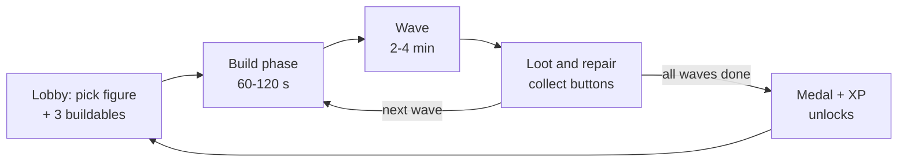
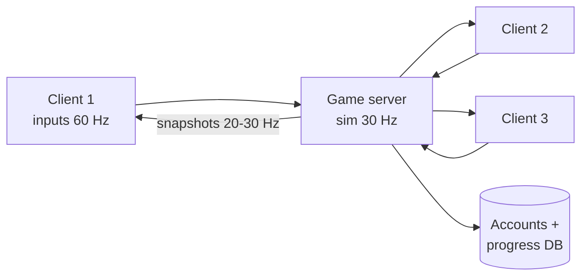

# STITCHSTRIKE (working title) — Full Build Plan

**A browser-based multiplayer toy shooter where hand-knitted wool toys defend a child's room.**
Built with Three.js, same web-first approach as the Foldline watercolour project.

Version 1.0 · 30 Sep 2026

---

## Table of contents

1. Pitch and pillars
2. Reference study: what HYPERCHARGE: Unboxed does (and what we keep, change, avoid)
3. Reference study: the wool toy look and the bedroom screenshot
4. Story and world
5. Core gameplay loop
6. Game modes (co-op, PvP, party)
7. The player figure: movement, camera, health
8. Weapons
9. Buildables, build pads and the Spool power system
10. Enemies and bosses
11. Maps
12. Characters, customisation and progression
13. Art direction and the wool rendering pipeline (Three.js)
14. Lighting, post-processing and the "tiny toy" camera feel
15. Audio and music
16. UI and HUD
17. Multiplayer networking architecture
18. Technical stack, engine architecture and performance budgets
19. Asset pipeline
20. Roadmap, team, budget of effort
21. Risks and mitigations
22. Success checklist
23. Sources

---

## 1. Pitch and pillars

**Pitch:** You are a small handmade knitted toy, about 15 cm tall, living in a real child's room. At night (and while the kid is at school) an army of cheap, mass-produced plastic toys and hungry moths invades to steal the **Heartspool** — a glowing ball of yarn that holds every memory the child has of their handmade toys. If it unravels, the child forgets you ever existed. Grab a pom-pom blaster, build tangle traps and button turrets, and hold the line with up to 3 friends — or fight 8 players in PvP across giant bedrooms, kitchens and sewing rooms.

**One-line hook:** "Soft toys. Hard fights."

**Design pillars** (every feature must serve at least one):

1. **Tiny hero, giant world.** Every map is a real room at toy scale. Chairs are cliffs, shelves are towers, a sunbeam through blinds is a stage light.
2. **Wool vs plastic.** The heroes are soft, fuzzy, hand-stitched and imperfect. The enemies are shiny, hard, factory-made. The contrast drives the art, the sound and the story.
3. **Shoot + build.** A fast, simple arena shooter fused with light tower defence. Build between waves, fight during them.
4. **Classic, fair, friendly.** No pay-to-win, no complex meta. Unlocks are earned by playing. Friendly to families and casual players, deep enough for friends who want a challenge.
5. **Instant in the browser.** Click a link, you're in a lobby with your friends in under 20 seconds. No install, no launcher.

**Platforms:** Desktop browser first (Chrome, Edge, Firefox, Safari), keyboard + mouse and gamepad. Later: Steam wrapper (Electron/Tauri), tablets.

**Players:** 1–4 co-op, up to 8 PvP.

**Session:** 12–25 min per co-op map, 8–10 min per PvP match.

---

## 2. Reference study: HYPERCHARGE: Unboxed

HYPERCHARGE: Unboxed (Digital Cybercherries, 2020, Unreal Engine) is the "vibe" reference. Here is how it works, broken into systems, and what we do with each.

### 2.1 What the reference game is

| System | How it works in the reference | Our version |
|---|---|---|
| Genre | First- and third-person action shooter where you play an action figure; wave-based tower defence + classic PvP | Same mix, but wool toys instead of action figures |
| Co-op | 1–4 players online/local, difficulty scales with player count | 1–4 online (browser), same scaling |
| PvP | 8 players; Deathmatch, Team Deathmatch, King of the Hill, Capture the Battery, Infection | 8 players; our own 5 modes (section 6) |
| Objective | Defend the Hypercores (usually three per map) from waves of weaponised toys | Defend Heartspools (1–3 per map) |
| Waves | 5–6 waves per map on Normal; build phase before each wave | Same structure |
| Build phase | Collect credits, build on coloured floor panels near the cores; only 3 buildable types chosen per match from a larger unlockable set (26 total) | Same "deck of 3" idea; buttons as currency; stitched build pads |
| Batteries | Batteries recharge core shields and power turrets; explosive enemies can knock them out | "Spools of thread" do the same job |
| Weapons | Map decides your spawn weapon; more spawn free between waves or in paid "Hypercharge boxes"; shotgun and glue are standout picks | Map spawn weapon + "Sewing Kit" loot boxes bought with in-match buttons (never real money) |
| Movement | Climbing, jumping, scaling objects to reach high spots | Same + our unique yarn-swing |
| Progression | Medals per map (grades), unlocks buildables, cosmetics, levels; custom heads, skins, even the toy's packaging box | Same philosophy; button medals |
| Difficulty | Casual (longer build time, weaker enemies) up to Nightmare | Cosy → Normal → Hard → Moth Season |
| Party modes | Spinner Battle, Tank Arena | Spinning Top Brawl, Yarn Ball Derby |
| Tone | Late-80s/90s toy commercial nostalgia, high-energy electric-guitar soundtrack | Handmade nostalgia (grandma's knitting, 90s kids' TV), guitar + toy instruments |
| Business | No microtransactions, "unlock the old-school way" | Same promise (optional cosmetic supporter pack only) |
| Story | Sgt. Max Ammo leads the defence, villain Major Evil wants to erase human memories | Our own original story (section 4) |

### 2.2 What makes it fun (keep these)

- The **scale fantasy**: normal rooms become battlefields; ordinary objects become vantage points and cover.
- **Build → fight rhythm**: calm planning, then chaos. The calm phase gives co-op players time to talk.
- **Limited deck of 3 buildables**: forces choices and teamwork (each player brings different cards).
- **Batteries you must carry**: creates small emergencies mid-wave ("someone put a battery back in core B!").
- **Simple gunplay**: easy to learn, no meta.
- **Toy-box unlocks**: collecting cosmetics is the long-term hook.

### 2.3 Weak points reviewers mention (fix these)

- Gunplay gets repetitive; guns feel similar. → Each of our weapons has a unique toy-physical effect (tangle, bounce, stick, pull) — section 8.
- Shallow player progression. → Add figure "patches" (small perks), weekly challenges and a map-mastery track.
- Hard to find PvP matches in less-popular modes. → Rotating playlists (2–3 modes live at once), bots fill empty slots, private lobby links.
- Repetitive campaign structure. → Map events (the kid comes home, the lights go out, the cat wanders in) and mid-map objective changes.

### 2.4 Legal line

The reference itself carefully avoids third-party copyrighted toys. We must do the same: **no Nintendo, Fallout, Half-Life, Marvel, etc. characters**, even as wool versions (three of the wool photos you shared are knitted versions of famous game characters — use them only for the *knitting style*, not the characters). No real toy brands. Our own names: no "Hypercore", "Max Ammo", "Major Evil", or copied map names.

---

## 3. Reference study: wool toys and the bedroom

### 3.1 What the four wool photos teach us

| Photo | Key visual lessons |
|---|---|
| 1 — Bearded figure with glasses | Mixed materials: crochet head (tight rows visible), felted grey beard (fuzzy, no stitches), chunky knit jacket with ribbed collar, **hard plastic glasses** — mixing one hard material into a soft toy looks great. Strong fuzz halo against a blurred background. |
| 2 — Seated boy in blue jumpsuit | Stocking-stitch "V" pattern on the body, ribbed cuffs, embroidered eyes (black beads), a single hard button as a belt buckle. Proportions: big head (~40% of height), stubby limbs. |
| 3 — Elf-style adventurer | Single-crochet texture (little "x" bumps), yarn "hair" as thick locks, **hard grey plastic sword and shield** — weapons can be non-wool. Tilt-shift depth of field makes it feel tiny. |
| 4 — Seal on a trike | Even vehicles are knitted: tyres from dark chunky yarn with a lighter rim. Denim-look yarn. Simple stitched smile. |

**Rules we take:**

- Heads are big and round; limbs are tubes; hands are mitten balls.
- Faces: 2 bead eyes, stitched nose/mouth, sometimes felt cheeks. Very few expressions, but they read clearly.
- Every surface shows **stitch structure** (knit V's, crochet bumps, ribbing) plus **fuzz** (loose fibres that catch light at the edges).
- Accessories and weapons can be hard: plastic, wood, metal buttons, safety pins, bottle caps. This contrast is our visual identity.
- Photos always have **shallow depth of field** and warm, soft light — the camera should feel like a macro lens.

### 3.2 What the bedroom screenshot teaches us

- **Low camera, huge room:** eye height ~12 cm; the desk chair is a building.
- **Hero light:** sunlight through window blinds creates bright god rays, a strong warm key light, and slatted shadows on the floor.
- **Colour:** saturated toy colours (red, blue, lime green, orange) on a calm blue-grey room. Bloom on hot highlights.
- **Clutter as level design:** scattered toy parts are cover, a spinning top is an enemy, bookshelves are climbable towers, a bean bag is a soft high ground.
- **Chunky first-person weapon** filling the bottom-right corner, bright and readable.
- Glowing capsule/core object in the middle distance = the objective, readable from anywhere.

Our twist: keep that exact lighting and scale, but the player's arm and gun are **knitted** (fuzzy green yarn blaster with a wooden spool drum), and the enemies are the hard shiny plastic.

---

## 4. Story and world

- **The Heartspool:** Every handmade toy is stitched with a thread from the maker's heart. All those threads meet in a glowing yarn ball hidden in each home. It keeps the child's memories of their handmade toys alive.
- **The villain — Baron Snip:** A pair of chrome scissors who leads the **Mass-Made** army: wind-up soldiers, RC cars, plastic robots, spinning tops. He believes toys should be identical, cheap and replaceable. Cutting the Heartspool makes the child forget handmade toys, so only factory toys remain.
- **The wild card — the Moths:** A moth swarm that eats wool. They attack everyone, including the Mass-Made, and appear as a third faction on some maps.
- **The heroes — the Stitch Squad:** Knitted toys made by one grandmother over 40 years. Leader: **Nana's Needle** (radio voice, a wise old knitted owl on the shelf) who briefs you before each map.
- **Tone:** Warm, funny, a little bittersweet. Like a Saturday-morning cartoon narrated by a grandmother.
- **Story delivery:** short radio briefings, 2D "paper puppet" cutscenes between chapters, notes pinned on walls.

---

## 5. Core gameplay loop



**Match (co-op defence) step by step:**

1. **Lobby:** choose figure, cosmetics, and a deck of 3 buildables. See the enemy types coming so the team can plan.
2. **Drop-in:** the team spawns near the Heartspools. Each player has the map's starting weapon.
3. **Build phase (60–120 s; longer on Cosy):** collect buttons (currency) scattered around the room, carry Spools to power Heartspools, build on stitched build pads, open Sewing Kits for weapons. Anyone can press "Ready" to skip.
4. **Wave (5–6 per map on Normal):** enemies come along lanes. Players shoot, repair, move Spools, revive teammates.
5. **Between waves:** enemies drop buttons; new weapons and Spools spawn.
6. **End:** medal based on Heartspool health remaining, time, and team damage taken. If all Heartspools are cut, the map is lost (retry).

**Minute-to-minute feel:** 70% shooting and moving, 20% building/repairing, 10% emergencies (carrying a Spool under fire, reviving).

---

## 6. Game modes

### 6.1 Co-op (1–4 players)

| Mode | Description |
|---|---|
| **Defence (main)** | 5–6 waves, 1–3 Heartspools. The heart of the game. |
| **Story** | Defence maps in chapter order with briefings and cutscenes, plus 1 unique twist per map. |
| **Endless** | Waves until you fall; leaderboards per map. |
| **Challenge maps** | Rule twists: only one weapon type, no buildables, moths only, lights off. |

**Difficulty:** Cosy (long build time, weaker enemies, generous revives) · Normal · Hard · Moth Season (nightmare; enemies eat buildables).
**Scaling:** enemy HP × (0.7 + 0.3 × players); enemy count × (0.6 + 0.4 × players).

### 6.2 PvP (up to 8 players)

| Mode | Players | Rules |
|---|---|---|
| **Free-for-All** | 2–8 | First to 25 knockouts. |
| **Team Tangle** | 4v4 | Team deathmatch, first to 50. |
| **Capture the Button** | 4v4 | Steal the enemy's giant button, bring it home. Carrier is slower. |
| **King of the Cushion** | 2–8 | Hold a moving cushion zone. |
| **Unravel** (infection) | 4–8 | One player starts as a Moth; hit players turn into Moths. Survivors win if any last 3 minutes. |

Rotate 2–3 modes in public playlists; always allow private lobbies with any mode. Fill empty slots with bots.

### 6.3 Party modes (unlockable)

- **Spinning Top Brawl:** control a wool-wrapped spinning top in a dinner-plate arena, knock others off.
- **Yarn Ball Derby:** roll a yarn ball race through the house; it gets bigger as you pick up thread (Katamari-lite).

---

## 7. The player figure

### 7.1 Scale and units

- **1 Three.js unit = 10 cm real world.** A toy is 1.5 units tall; a door is 20 units; a bedroom is ~40 × 35 × 25 units. This keeps physics numbers in a comfortable range (avoid 0.15 m players).

### 7.2 Movement

| Action | Default | Notes |
|---|---|---|
| Walk / run | WASD, 5 u/s run | No stamina; sprint toggle optional (7 u/s) |
| Jump | Space, 2.2 u high | Soft squash on landing |
| Double jump | Space in air | Wool "puff" that looks like a bounce |
| Mantle / climb | Hold Space at an edge | Climb any surface tagged "fabric" (curtains, bean bag, bed sheet) by holding forward |
| **Yarn swing** (signature) | E / right bumper | Shoot a thread to a hook point (drawer knob, lamp, shelf edge) and swing; 6 s cooldown. Our unique move vs the reference |
| Slide | Ctrl while running | Short, no slide-cancel tricks (keep it simple and fair) |
| Crouch | C | Smaller hitbox, better accuracy |

### 7.3 Camera

- **First person** (default in defence) and **third person** over-the-shoulder (toggle V), like the reference.
- In third person, the camera shows the fuzzy toy clearly; this is where the wool rendering shines.
- FOV slider 70–110.

### 7.4 Health: "Stitches"

- 100 Stitch points. Damage shows visually: loose threads, a patch popping off, stuffing fluff particles.
- At 0 you are **Unravelled** (downed): you slump into a yarn pile. Teammates hold E for 3 s to re-stitch you. After 20 s you respawn at the Heartspool (co-op) or a spawn point (PvP).
- **Repair:** Darning stations and "thread pickups" heal.

---

## 8. Weapons

Each weapon is a handmade or found-object toy gun. Every weapon has one **physical toy effect** so they feel different (the reference's main weakness).

| Weapon | Role | Fire | Damage / rate | Special effect |
|---|---|---|---|---|
| **Pom-Pom Popper** | Starter SMG | Auto, projectile | 9 dmg, 12/s, 40 mag | Pom-poms bounce once off walls |
| **Button Buster** | Shotgun | 8 buttons per shot | 8 × 11 dmg, 1.1/s | Knockback; great vs swarms and spinners |
| **Needle Bow** | Sniper | Charged, hitscan at full charge | 90 dmg (150 headshot) | Pins light enemies to walls |
| **Tangle Launcher** | Grenade launcher | Arcing yarn ball | 60 splash | Leaves a tangle web: enemies slowed 50% for 4 s |
| **Glue Squirter** | Support | Stream | 5 dmg/s | Sticks enemies to the floor (the reference's "glue" is a fan favourite) |
| **Thimble Cannon** | Heavy | Slow big shot | 120 dmg | Pierces through lines of enemies |
| **Magnet Mitten** | Utility | Hold to pull | 0 dmg | Pulls metal enemies/buttons toward you; drops them off ledges |
| **Knitting Needles** | Melee | Swing | 45 dmg | Always equipped (F); fast lunge |
| **Spool Minigun** | Rare power weapon | Spin-up auto | 14 dmg, 20/s | Only from Golden Sewing Kits; slows you |

**Rules**

- Carry 2 weapons + melee. Swap with 1/2 or scroll.
- Ammo is "yarn" — shared pool per weapon class, refilled from yarn skeins on the map.
- Weapon skins are earned cosmetics (colourways: Rainbow, Denim, Mohair, Christmas Jumper).
- Hit feedback: soft "thwump" hit markers, plastic enemies crack and fling parts, damage numbers optional.

---

## 9. Buildables, build pads and Spools

### 9.1 How building works

- Maps have **stitched build pads** (a round embroidered patch on the floor/shelf) around each Heartspool, colour-coded to the Heartspool they protect. 6–10 pads per Heartspool.
- Each player brings a **deck of 3 buildable cards** into a match (chosen in the lobby). Teammates should bring different decks.
- Building costs **buttons** (currency). Look at a pad, press Q to open the deck wheel, pick a card.
- Buildables have HP, can be repaired (hold R near them, costs buttons) and sold back for 50%.
- Upgrades: each buildable has 2 upgrade levels (costs more buttons).

### 9.2 Buildable list (24 at launch, start with 4 unlocked)

| Buildable | Type | Cost | What it does | Unlock |
|---|---|---|---|---|
| Pom-Pom Turret | Turret | 150 | Auto-fires pom-poms at nearest enemy | Start |
| Pin Wall | Barrier | 80 | Blocks a lane; enemies must break it | Start |
| Tangle Mat | Trap | 100 | Slows enemies 60% on it | Start |
| Darning Station | Support | 200 | Heals players and buildables nearby | Start |
| Needle Sentry | Turret | 250 | Long-range, high damage, slow | Bronze on map 2 |
| Glue Pot | Trap | 120 | Sticks enemies for 3 s, then cooldown | Silver on map 1 |
| Hot Iron | Trap | 220 | Slams down, burns plastic enemies (bonus vs plastic) | Gold map 3 |
| Bobbin Zapper | Trap | 260 | Static shock, stuns robots and RC cars | Silver map 4 |
| Sewing Machine Gun | Heavy turret | 400 | Rapid needle fire in a cone | Gold map 5 |
| Mothball Launcher | Turret | 300 | Mortar; strong vs Moths | Moth map clear |
| Button Magnet | Utility | 150 | Pulls dropped buttons to the team | Level 8 |
| Yarn Catapult | Turret | 350 | Throws yarn balls over walls | Level 15 |
| Decoy Doll | Utility | 180 | Enemies target it for 8 s | Level 20 |
| … | | | (fill to 24 during content phase) | |

Better versions of existing buildables unlock with higher medals (as in the reference, e.g. a "Hot Iron" → "Steam Press").

### 9.3 Spools (power system)

- **Heartspools** have a shield (blue-glowing thread wrap) and a health bar.
- **Spools of thread** (battery equivalent) spawn around the map. Carry one (slower movement, can't shoot main weapon) and slot it into a Heartspool: it recharges the shield and **powers turrets** within 10 u of that Heartspool.
- Spools drain over time. Explosive and grabbing enemies can knock Spools out; players must put them back.
- This creates the "run across the room under fire" hero moments that make co-op memorable.

---

## 10. Enemies and bosses

Faction 1: **Mass-Made** (hard plastic, shiny, identical). Faction 2: **Moths** (organic, fluttery, eat wool). Enemies target Heartspools first, players second, buildables when blocked.

| Enemy | Faction | HP | Speed | Behaviour | Counter |
|---|---|---|---|---|---|
| Wind-Up Walker | Mass-Made | 60 | Slow | Marches in lines, winds down if key shot | Anything; shoot the key |
| Snap Soldier | Mass-Made | 90 | Medium | Plastic army figure, shoots from range | Cover, Needle Bow |
| Spinner | Mass-Made | 120 | Fast | Spinning top, ricochets off walls, knocks players | Button Buster, Pin Walls |
| RC Bomber | Mass-Made | 70 | Very fast | Races to Heartspool, explodes, knocks Spools out | Glue, Tangle Mat |
| Paper Plane | Mass-Made | 40 | Fast, flying | Dives on turrets | Pom-Pom Turret |
| Robo-Brick | Mass-Made | 400 | Slow | Tank made of plastic bricks; breaks into 4 small bricks | Hot Iron, Thimble Cannon |
| Grabber Claw | Mass-Made | 200 | Medium | Steals Spools and runs | Magnet Mitten |
| Moth Larva | Moth | 30 | Slow, swarm | Eats buildables and deals double damage to players (wool!) | Mothball Launcher |
| Moth | Moth | 50 | Fast, flying | Erratic flight, swarms lights | Tangle Launcher |
| Moth Queen | Moth | 1500 | Boss | Summons swarms, dims the lights | Team focus |
| **Robo-Vac** | Boss | 3000 | Slow | Robot vacuum sweeps lanes, sucks players/buildables in; weak spot = dust bin | Shoot bin when open |
| **Baron Snip** | Final boss | 6000 | Medium | Giant scissors, cuts pads and lanes, 3 phases | Glue legs, pin him down |

**AI:** navmesh pathfinding (recast-navigation-js) with lanes defined per map; flying units use simple steering. Crowd separation to avoid clumping. All AI runs on the server only (section 17).

**Wave composition:** a JSON table per map: wave → list of (enemy, count, spawn point, delay). Wave 1 = 20–30 enemies; final wave = 80–150 + boss.

---

## 11. Maps

### 11.1 Launch maps (co-op + PvP versions of each)

| Map | Room | Heartspools | Signature features |
|---|---|---|---|
| **Sunbeam Bedroom** | Kid's bedroom (from your screenshot) | 3 | God rays through blinds, climbable bookshelf tower, bean bag high ground, desk chair that spins when shot |
| **Kitchen Counter** | Kitchen worktop + floor | 2 | Toaster that pops (launch pad), sink with running water (slows), fridge magnet climbing wall |
| **Nana's Sewing Room** | Craft room | 3 | Sewing machine the boss uses, pincushion hills, hanging threads for yarn-swing everywhere |
| **Bath Time** | Bathroom | 2 | Bathtub arena, rubber duck boats, bubbles you can jump on |
| **Laundry Day** | Laundry room | 2 | Washing machine drum that rotates (danger zone), sock piles, moth nest |
| **Attic of Lost Toys** | Dusty attic | 3 | Dark, torch-lit; moths drawn to lamps; old toys as neutral props |
| **Back Garden Sandbox** | Outdoors | 3 | Sand slows, garden hose, wind, a curious cat event |
| **The Toy Store** (finale) | Shop at night | 3 | Baron Snip's base: shelves of identical plastic toys |

### 11.2 Level design rules

- **Three layers of height** on every map: floor, furniture top (5–10 u), high shelves (15–25 u). Climb routes and yarn-swing hooks connect them.
- **Lanes:** 2–4 enemy lanes per Heartspool, readable from the Heartspool.
- **Build pads** cluster at choke points; always 1–2 "clever" pads on high ground.
- **Scale props** are the fun: pencils as bridges, books as ramps, LEGO-like bricks (generic) as walls.
- **Readability:** Heartspools glow and have a vertical light beam; enemy spawns have a coloured doorway (e.g., under the bed with red eyes).
- **Events** every map: the kid's footsteps (everything shakes), the light switch (night mode), the cat (neutral giant that swats anyone).
- **PvP variants:** remove Heartspools, add power-weapon spawns and mirrored team bases.

### 11.3 Grey-box first

Build every map first with plain boxes in Blender at correct scale, playtest movement and sightlines, then dress it.

---

## 12. Characters, customisation and progression

### 12.1 Starting roster (all original)

| Figure | Look | Personality |
|---|---|---|
| **Grumble** | Old bearded bear-man, felted grey beard, plastic spectacles, orange knit jacket | Grumpy veteran, secretly soft |
| **Pip** | Small seal in a blue jumper and denim yarn trousers, rides a knitted trike in menus | Cheerful rookie |
| **Bramble** | Fox-eared adventurer in a green pointy hood, button shield | Brave explorer |
| **Dot** | Round ladybird girl, red with black felt spots, pom-pom hair | Fast talker, loves turrets |
| **Captain Cuff** | Sock-puppet sailor with a bottle-cap hat | Leader, radio voice in menus |
| **Nana's Owl** | Mission briefer (not playable at launch) | Wise, kind |

**Figure differences are cosmetic only** (fair PvP). Optional later: one passive "patch" slot per figure (e.g., +10% repair speed).

### 12.2 Customisation (like the reference: heads, skins, even the box)

- Head, body, colourway (yarn colour + pattern: stripes, Fair Isle, cable knit, mohair fuzz), eyes (bead, button, stitched), accessories (glasses, scarves, badges), weapon colourways.
- **Packaging:** the "box" your figure appears in on the lobby shelf (cardboard box, gift bag, knitting basket, jam jar).
- **Emotes:** wave, spin, flop, "unravel and re-knit".
- Customisation uses a modular rig: all heads/bodies share one skeleton; colourways are material parameters (no new textures needed).

### 12.3 Progression

- **XP & levels 1–50:** from matches, waves, knockouts, revives.
- **Medals per map:** Wood → Brass → Silver → Gold → Pearl (all Heartspools at full health). Medals unlock buildables, maps and cosmetics.
- **Collectibles:** hidden lost buttons on each map (unlock special items).
- **Weekly challenges:** 3 per week, cosmetic rewards.
- **No pay-to-win, no loot boxes for real money.** Optional one-time "Supporter Pack" of cosmetics only.

---

## 13. Art direction and the wool rendering pipeline

### 13.1 Style in one sentence

Soft, fuzzy, handmade wool heroes in a warm, realistic-but-stylised giant room, fighting shiny hard plastic enemies, photographed like a macro toy photo.

### 13.2 Material families

| Family | Where | Look | Three.js approach |
|---|---|---|---|
| **Knit wool** | Heroes' clothes, some props | Visible V-stitches, fuzz, sheen | `MeshPhysicalMaterial` with `sheen`, stitch normal map, fuzz shells |
| **Crochet** | Heroes' heads, limbs | Small round bumps in rows | Crochet normal + AO map, fuzz shells |
| **Felt** | Beards, cheeks, patches | Matte, no stitches, dense fuzz | Noise normal, high roughness, strong sheen |
| **Plastic** | Enemies, toy props | Glossy, bright, hard edges, sharp highlights | `MeshStandardMaterial` roughness 0.2–0.35, clearcoat on hero enemies |
| **Room** | Furniture, walls, carpet | Stylised PBR, baked lighting | Standard + lightmaps |
| **Hard accessories** | Glasses, buttons, needles, weapons | Wood, metal, plastic | Standard PBR |

### 13.3 The wool shader (most important art task)

Build it in layers; each layer is toggled by quality preset.

1. **Stitch pattern (all presets):** tiling normal + AO + height maps for knit stocking-stitch, rib, garter, crochet. Author once in Substance Designer / Blender, or procedural in shader. Scale in world space so stitches are consistent across all figures (≈ 6–8 stitches per unit).
2. **Yarn colour variation:** multiply albedo by a low-frequency noise and a per-stitch random tint (±5% hue) so it looks hand-dyed, not flat.
3. **Sheen (all presets):** `MeshPhysicalMaterial.sheen = 1`, `sheenRoughness 0.5–0.8`, `sheenColor` slightly lighter than yarn. This alone gives 60% of the fabric look.
4. **Fuzz rim (Medium+):** fresnel-based soft light added at silhouettes, with noise so edges look furry.
5. **Shell fuzz (High+, heroes only):** draw the mesh 8–16 extra times, each shell pushed out along normals by 0.3–1.5 mm (scaled), alpha-tested with a fibre noise texture — the classic fur technique. Use `InstancedMesh` or a vertex-shader loop to keep draw calls low. Only within ~8 u of the camera; beyond that, fall back to fuzz rim.
6. **Stray fibres (Ultra):** a few hundred thin curved card strands on silhouettes of the player's own figure and weapon.
7. **Subsurface fake:** wrap lighting (diffuse term `max(0, (N·L + w)/(1 + w))`, w≈0.4) so light softly wraps around wool.

**First-person arm and weapon** get the full treatment at all quality levels (they're always on screen and cheap — one mesh).

### 13.4 Plastic enemies

- Bright primary colours, glossy, with visible mould seams and screws (generic, no brands).
- When hit: crack decals; when destroyed: break into 3–8 physics parts that bounce and fade after 3 s (pooled).

### 13.5 Colour palette

| Role | Hex |
|---|---|
| Wool warm orange | #E8742A |
| Wool lime | #8BCB3A |
| Wool denim blue | #3A5DA8 |
| Wool cream | #EFE3C8 |
| Plastic red | #D8262E |
| Plastic blue | #2F7FE0 |
| Heartspool glow | #FFC94A |
| Shield thread | #6FD6FF |
| Room wall blue-grey | #5E6B86 |
| Sunlight | #FFD9A0 |

---

## 14. Lighting, post-processing and the "tiny toy" camera

### 14.1 Lighting

- **Baked lightmaps** for static room geometry (Blender Cycles bake → lightmap UV2) — gives soft realistic bounce light for free at runtime.
- **One real-time directional light** (the sun) with a shadow map that follows the player (cascaded shadow maps on High).
- **Light probes / irradiance volume** so moving figures pick up bounce colour from the room.
- **God rays:** screen-space volumetric light scattering from the window (radial blur of a bright mask), or cheap mesh-based light shafts with animated dust particles. Blind slats cast stripes.
- **Emissive glows:** Heartspools, screens, enemy eyes, muzzle flashes.
- **Map variants:** morning sun, afternoon gold, night (blue moonlight + desk lamp + glow-in-the-dark stars).

### 14.2 Post-processing chain

1. SSAO (N8AO) — grounds tiny objects on the carpet.
2. Bloom (selective, threshold high) — sun, glows.
3. **Depth of field (tilt-shift feel):** subtle background blur in third person and menus to sell "tiny toy macro photo" like your wool photos. Off during first-person aiming.
4. Tonemapping: AgX or ACES, warm colour-grading LUT.
5. Light vignette + film grain (very small).
6. FXAA/SMAA (or TAA on High).

### 14.3 Camera feel

- First person: low (1.2 u eye height), FOV 90, weapon bob that feels bouncy/soft.
- Third person: 3 u behind, slightly above, DOF on.
- Menus/lobby: macro "product shot" of your figure on a shelf with bokeh background.

---

## 15. Audio and music

| Layer | Direction |
|---|---|
| Music | High-energy garage rock (the reference uses energetic electric-guitar tracks per stage) mixed with toy instruments: xylophone, toy piano, kazoo, ukulele. One track per map + build-phase calm version (same melody, softer). |
| Wool sounds | Soft thuds, fabric rustle footsteps, yarn "fwip" for swing, pillowy landings |
| Plastic sounds | Clacks, cracks, wind-up clicks, RC motor whine, tinny speakers for enemy "voices" |
| Weapons | Toy-like but punchy: pom "pop", button "chk-chk", needle "thwip" |
| Voice | Nana's Owl briefings, short figure barks ("Spool's out!", "Re-stitch me!") |
| UI | Scissors snip, zipper, button click |

Use Web Audio API with spatial panner nodes (HRTF), distance attenuation, and a limiter. Stream music, preload SFX sprites. Audio starts after first click (browser autoplay rule).

---

## 16. UI and HUD

**Style:** stitched felt patches, fabric labels, cardboard toy-packaging panels, hand-drawn icons. Fonts: one chunky rounded display font + one clean UI font.

### 16.1 In-match HUD

| Position | Element |
|---|---|
| Top-centre | Wave number, timer / build-phase countdown, "Ready" count (2/4) |
| Top-left | Heartspool health + shield bars (A, B, C) with colour, alert icon when a Spool is removed |
| Top-right | Team list with health and status (downed icons) |
| Bottom-left | Stitches (health) as a yarn bar; buttons (currency) |
| Bottom-right | Weapon, ammo (yarn), second weapon, yarn-swing cooldown |
| Centre | Crosshair (plus-shaped stitch), hit markers |
| Bottom-centre (build phase) | Deck wheel with 3 buildables and costs |
| World-space | Pad outlines, enemy health bars, ping markers |

**Ping system** (middle mouse): "Build here", "Enemy", "Spool needed" — essential for voice-less browser players.

### 16.2 Screens

1. Loading: a knitting animation that fills a row per % loaded.
2. Title: your figure in its box on a shelf; Play, Customise, Settings.
3. Play menu: Co-op (map grid with medals), PvP playlists, Private lobby (share link / code), Party modes.
4. Lobby: 4 shelf slots showing each player's figure, deck of 3, ready toggle, map info with enemy list.
5. Customise ("Toy Box"): figure, colourway, box, emotes, weapon skins.
6. End screen: medal animation, XP bar, unlocks, stats (damage, revives, buttons, MVP).
7. Settings: graphics preset, FOV, sensitivity, key binds, audio sliders, colour-blind modes, reduced camera shake.

---

## 17. Multiplayer networking architecture

This is the hardest and most important part of a browser shooter. Decide it on day 1.

### 17.1 Model: authoritative server

- **The server is the truth.** It runs the full simulation: player movement validation, all enemy AI, hits, damage, buildables, Spools, waves, scores.
- **Clients** send only inputs (keys, mouse look, fire, actions) with a sequence number, and render what the server says, smoothed.
- This prevents most cheating and makes co-op enemies consistent for everyone.



### 17.2 Transport

| Option | Pros | Cons | Use |
|---|---|---|---|
| WebSocket (TCP) | Simple, works everywhere | Head-of-line blocking under packet loss | Lobby, chat, match setup; OK for co-op at launch |
| WebRTC DataChannel (unreliable, unordered) | UDP-like, best for fast shooters | More setup (STUN/TURN) | Gameplay traffic for PvP (e.g. geckos.io) |
| WebTransport (HTTP/3) | UDP-like datagrams, simpler than WebRTC | Safari support still limited — check current status | Future upgrade |

**Plan:** start with WebSocket (Colyseus or uWebSockets.js) to ship fast; abstract the transport so gameplay can move to WebRTC/WebTransport datagrams before PvP launch.

### 17.3 Netcode techniques (required)

1. **Client-side prediction:** the local player moves instantly using the same movement code as the server (shared TypeScript package).
2. **Server reconciliation:** when a snapshot arrives, snap to the server position for the last acknowledged input, replay unacknowledged inputs. Smooth small corrections over 100 ms.
3. **Entity interpolation:** render other players and enemies ~100 ms in the past, interpolating between snapshots.
4. **Lag compensation (hitscan):** server keeps 1 s of position history; when a hit arrives, rewind targets to the shooter's view time, test the ray, then apply damage. Cap rewind at 200 ms.
5. **Projectiles:** spawn immediately on the shooter's client (visual), server simulates the real one; other clients see it from the snapshot.
6. **Delta-compressed binary snapshots:** only send what changed; quantise positions (16-bit per axis within map bounds), angles (8–10 bits), health (8 bits). Use a custom ArrayBuffer serializer or Colyseus schema.
7. **Interest management:** in PvP, only send players near/visible to each client. In co-op, send all enemies but at lower rate/precision when far.
8. **Enemy snapshots:** enemies move along navmesh paths; send path + speed events rather than per-tick positions where possible ("walker #231 follows lane 2 from t=12.4"), with periodic corrections. This makes 150 enemies cheap.

### 17.4 Rates and budgets

| Item | Target |
|---|---|
| Server tick | 30 Hz (co-op), 30–60 Hz (PvP) |
| Snapshot rate | 20 Hz co-op, 30 Hz PvP |
| Client input rate | 60 Hz, bundled 2 per packet |
| Bandwidth down per client | < 64 kbps co-op, < 96 kbps PvP |
| Playable latency | Good < 80 ms, OK < 150 ms, warn > 200 ms |
| Max enemies alive | 150 (co-op) |

### 17.5 Services around the game server

- **Matchmaking & lobbies:** party via share link (`/join/ABCD`), quick-play queues per region, bots fill empty PvP slots.
- **Accounts:** play as guest instantly (local ID), optional sign-in (email / Google / Discord) to save progress across devices.
- **Database:** Postgres (profiles, unlocks, medals, stats), Redis (lobbies, presence).
- **Hosting:** containerised game servers (Docker) on regional hosts (EU, US-East, US-West, Asia); a fleet manager (e.g. Edgegap, Hathora-style, or own Kubernetes/Agones) spins rooms up and down. One process can host several co-op rooms.
- **Region selection:** ping each region on start, choose lowest.
- **Anti-cheat basics:** server validation of speed/position, fire rate, ammo, line of sight for hits; rate limiting; report button; don't trust client damage.
- **Reconnect:** a dropped player can rejoin the same room within 60 s.
- **Voice (optional, later):** WebRTC peer voice for parties only.

### 17.6 Single-player / offline

Run the **same server code in a Web Worker** in the browser for solo play (no network, zero latency). This means solo players need no server and the code path is shared.

---

## 18. Technical stack and architecture

### 18.1 Stack

| Area | Choice |
|---|---|
| Language | TypeScript everywhere (client, server, shared) — monorepo |
| Rendering | Three.js (WebGL2; WebGPU renderer when stable in target browsers) |
| Post-processing | `postprocessing` library + N8AO |
| Physics | Rapier (WASM) on server and client (character controller, raycasts) |
| Collision queries | three-mesh-bvh for fast raycasts against level meshes |
| Pathfinding | recast-navigation-js (navmesh baked per map) |
| Entity system | bitECS (or a simple custom ECS) — needed for 150+ enemies |
| Networking | Colyseus or uWebSockets.js (+ geckos.io / WebTransport later) |
| Audio | Web Audio API (+ Howler for simple cases) |
| UI | HTML/CSS overlay (Preact or Svelte for menus) |
| Build | Vite (client), esbuild/tsx (server), pnpm workspaces |
| Tests | Vitest for shared sim; headless bot clients for load tests |
| Analytics & errors | Self-hosted PostHog / Sentry |

### 18.2 Code structure

```
/packages
  /shared      → sim: movement, weapons, damage, buildables, waves, constants, net schema
  /client      → rendering, input, prediction, UI, audio, asset loading
  /server      → rooms, authoritative loop, AI, lag compensation, persistence
  /tools       → wave editor, map exporter checks, bot load tester
/assets        → glTF, textures (KTX2), audio, fonts
```

**Golden rule:** anything that affects gameplay lives in `/shared` and runs identically on client (prediction) and server (truth).

### 18.3 Performance budgets (mid laptop, 1080p, 60 fps)

| Item | Budget |
|---|---|
| Draw calls | < 400 (instancing for enemies, merged static room) |
| Triangles | < 1.5 M on screen |
| Heroes on screen with shell fuzz | ≤ 4 (others use fuzz rim) |
| Enemy meshes | 1–3 k tris each, `InstancedMesh` + vertex animation textures (VAT) or GPU skinning per type |
| Texture memory | < 400 MB, KTX2 compressed |
| First download | < 40 MB to lobby; stream each map 20–60 MB, cached |
| CPU frame | < 6 ms JS (AI is on server, client only interpolates) |

**Quality presets:** Low (no shells, no SSAO, no DOF, 75% resolution) · Medium · High · Ultra. Plus dynamic resolution to hold 60 fps.

**Enemy animation at scale:** bake walk/attack loops into vertex animation textures so 150 enemies are ~10 instanced draw calls.

---

## 19. Asset pipeline

1. **Concept:** paint-overs of each figure as a real crocheted toy (use your wool photo references for materials). Optionally crochet 1–2 real prototypes and photograph them — the best possible reference.
2. **Modelling (Blender):** low/mid poly, clean UVs with **consistent texel density** so stitches tile at the same size on every figure. Figures 4–8 k tris; weapons 2–4 k.
3. **Stitch material library:** 6 base patterns (stocking, rib, garter, seed, cable, crochet) as normal/AO/height sets, 1–2 k resolution, tileable.
4. **Rig:** one shared humanoid toy skeleton (short limbs, big head). Animations: idle, run, jump, climb, swing, shoot poses, downed, revive, 8 emotes. Mixamo-style retarget then hand-tweak for floppy "stuffed" feel (overshoot, squash).
5. **Room environments:** modular kits per room, baked lightmaps in Cycles, exported glTF with Meshopt compression + KTX2 textures.
6. **Export check tool:** script that validates scale, naming (`col_`, `pad_`, `hook_`, `spawn_` prefixes for gameplay markers), tri count, and material names.
7. **Audio:** WAV masters → OGG/AAC, loudness normalised.

---

## 20. Roadmap

Build the riskiest things first: **wool look + networked shooting**. If one grey-box bedroom with 4 networked players shooting 100 enemies feels good at 60 fps, the rest is content.

| Phase | Weeks | Goal | Done when |
|---|---|---|---|
| 0. Prototypes | 1–4 | (a) Wool shader test on one figure; (b) networked movement + shooting, 4 clients | A still image looks like a crochet toy photo; 4 players move smoothly at 150 ms fake lag |
| 1. Core loop | 5–10 | Grey-box Sunbeam Bedroom, 3 weapons, 4 buildables, Spools, 3 enemy types, 5 waves | A full co-op match is fun in grey-box |
| 2. Vertical slice | 11–18 | Bedroom fully art-dressed, 2 figures, HUD, lobby, share links, 6 enemies, 1 boss | Outsiders play and ask for more |
| 3. Content | 19–32 | 6 maps, all weapons, 16+ buildables, all enemies, progression, customisation | Co-op complete, medals and unlocks working |
| 4. PvP | 33–40 | 5 PvP modes, WebRTC/WebTransport gameplay channel, lag compensation, bots, playlists | 8-player matches fair at 100 ms |
| 5. Polish & scale | 41–48 | Quality presets, load tests (1,000 concurrent), anti-cheat checks, audio mix, story cutscenes, party modes | 60 fps on target laptop; servers stable |
| 6. Launch | 49–52 | Open beta → launch on web + itch.io, trailer, Discord community | Public release |

### 20.1 Team (minimum realistic)

- 2 programmers: one gameplay/network (server, netcode, AI), one graphics/client (Three.js, shaders, performance, UI).
- 1–2 3D artists: characters + wool materials; environments + lighting bakes.
- 1 animator (can be part-time / contractor).
- 1 game designer / producer (waves, balance, maps, testing).
- Part-time: composer/sound designer, UI artist, community manager near launch.

A solo developer can do the vertical slice (phases 0–2) in ~6–8 months with bought/commissioned assets.

### 20.2 Running costs to plan for

- Game servers (scale with players), database, CDN for assets, TURN server if using WebRTC, domain, analytics. Start small: one server per region, autoscale later.

---

## 21. Risks and mitigations

| Risk | Why it matters | Mitigation |
|---|---|---|
| Wool shader too expensive | Shells multiply draw cost | Shells only on near heroes; fuzz rim fallback; quality presets; test on a weak laptop in week 1 |
| Wool looks like carpet / noisy | Wrong stitch scale or too much normal strength | Consistent texel density; compare side by side with real crochet photos; tune in a live debug panel |
| Browser netcode feels laggy | Shooters are unforgiving | Prediction + reconciliation + lag compensation from the start; UDP-like transport for PvP |
| 150 enemies over the network | Bandwidth and CPU | Path-event sync, instancing, VAT animation, interest management |
| Server costs | Real money per player-hour | Solo runs in a Web Worker; many co-op rooms per process; region autoscaling |
| Low PvP population | Empty lobbies kill PvP | Bots, few playlists, private links, cross-mode queue fallback |
| Players can't coordinate without voice | Co-op depends on teamwork | Ping system, auto-suggested build spots, quick chat wheel |
| IP / trademark issues | Reference game and famous characters | 100% original names, characters, maps, story; no real toy brands |
| Scope creep | 24 buildables, 8 maps, PvP… | Vertical slice first; launch with 6 maps / 16 buildables if needed |

---

## 22. Success checklist

- [ ] A screenshot of a hero figure is mistaken for a photo of a real crochet toy.
- [ ] Wool vs plastic contrast is obvious in every frame.
- [ ] 60 fps on a mid laptop at High; 30+ fps on Low with integrated graphics.
- [ ] From clicking a friend's link to being in their lobby: under 20 seconds.
- [ ] Movement and shooting feel responsive at 150 ms latency.
- [ ] 4-player co-op with 150 enemies stays under 64 kbps per player.
- [ ] Every weapon has a distinct physical effect players can describe.
- [ ] A new player understands build → wave → Spools within the first map without reading text.
- [ ] Yarn-swing is the move everyone talks about.
- [ ] No pay-to-win; all gameplay items unlocked by playing.
- [ ] 8 of 10 playtesters want "one more wave".

**Next step:** Phase 0 — build one knitted figure (Pip) with the wool shader in a grey-box bedroom corner under a sunbeam, and at the same time a bare networked room where 4 capsules can move and shoot each other. Merge them in week 4.

---

## 23. Sources (reference game research)

- HYPERCHARGE: Unboxed — Steam store page: https://store.steampowered.com/app/523660/HYPERCHARGE_Unboxed/
- PlayStation store page: https://www.playstation.com/en-us/games/hypercharge-unboxed/
- Nintendo store page: https://www.nintendo.com/us/store/products/hypercharge-unboxed-switch/
- Official site (About): https://playhypercharge.com/about/
- Wikipedia: https://en.wikipedia.org/wiki/Hypercharge:_Unboxed
- TheSixthAxis review: https://www.thesixthaxis.com/2025/05/30/hypercharge-unboxed-review-ps5-xbox-switch-pc/
- GameGrin review: https://www.gamegrin.com/reviews/hypercharge-unboxed-review/
- Rapid Reviews UK review: https://www.rapidreviewsuk.com/hypercharge-unboxed-review/
- Smash Jump review: https://www.smashjump.com/reviews/hypercharge-unboxed-review/
- Screen Rant waves guide: https://screenrant.com/hypercharge-unboxed-waves-tips-tricks-strategies-guide/
- Charlie INTEL buildables list: https://www.charlieintel.com/games/hypercharge-unboxed-all-buildables-how-to-get-them-326874/
- Steam community quick guide: https://steamcommunity.com/sharedfiles/filedetails/?id=2371451403
